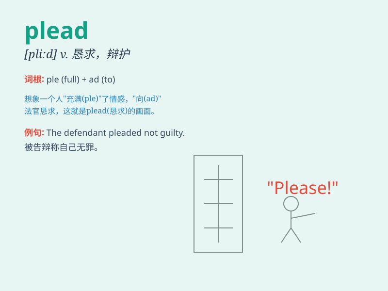

## plead

**英音:** _[pliːd]_ **美音:** _[plid]_

**译义:** *vi.辩护,恳求vt.为\...辩护,借口,托称*

### 短语

+ **plead guilty:** _服罪；认罪_

+ **plead innocent:** _辩称无罪_

+ **plead for:** _为\...\...辩护；恳求_

+ **plead with:** _向\...\...恳求_

+ **plead a case:** _申诉；为案件辩护_

### 例句

#### 例句1

> **The defendant pleaded not guilty.**

**中文翻译:** 被告申辩无罪。

**单词释义:** 申辩，辩护

#### 例句2

> **She pleaded with him to stay.**

**中文翻译:** 她恳求他留下。

**单词释义:** 恳求，请求

#### 例句3

> **He pleaded ignorance of the law.**

**中文翻译:** 他以不知法为由进行辩解。

**单词释义:** 辩解，以\...\...为借口

### 背诵小故事

> A man was wrongly accused of a crime. In court, he pleaded
desperately, saying, \'I\'m innocent! Please believe me!\' His sincere
plead finally convinced the jury.

**一个男人被错误地指控犯罪。在法庭上，他拼命恳求，说道：'我是无辜的！请相信我！'他真诚的恳求最终说服了陪审团。**

### 图义

