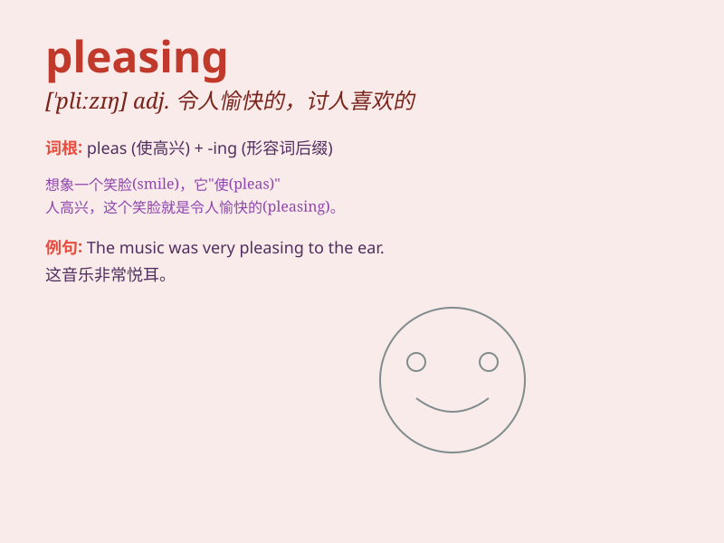

## pleasing

**英音:** _[\'pliːzɪŋ]_ **美音:** _[\'plizɪŋ]_

**译义:** *adj.令人高兴的,愉快的,合意的*

### 短语

+ **pleasing appearance:** _令人愉悦的外表_

+ **pleasing smile:** _讨人喜欢的微笑_

+ **pleasing personality:** _令人愉快的个性_

+ **pleasing voice:** _悦耳的声音_

+ **pleasing environment:** _宜人的环境_

### 例句

#### 例句1

> **The music was very pleasing to the ear.**

**中文翻译:** 这首音乐非常悦耳。

**单词释义:** 令人愉快的

#### 例句2

> **Her smile is pleasing.**

**中文翻译:** 她的微笑令人愉快。

**单词释义:** 令人喜欢的

#### 例句3

> **The painting has a pleasing color combination.**

**中文翻译:** 这幅画的颜色组合令人满意。

**单词释义:** 令人满意的

### 背诵小故事

> A little girl was drawing a rainbow. The colors were so bright and
the picture was pleasing. Everyone who saw it smiled. It made her happy
to bring such pleasing joy to others.

**一个小女孩正在画彩虹。颜色非常鲜艳，这幅画令人愉悦。每个看到它的人都笑了。能给别人带来这样令人愉快的快乐让她很开心。**

### 图义

