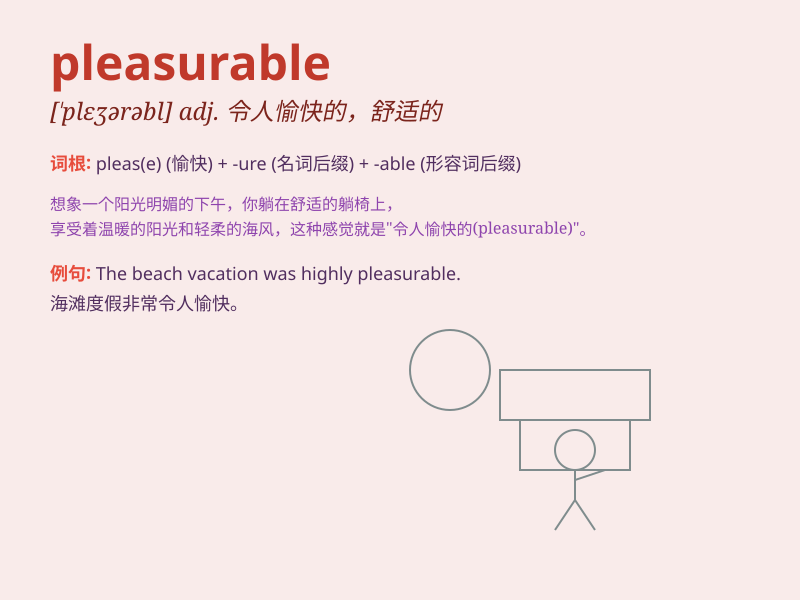

## pleasurable

**英音:** _[\'pleʒ(ə)rəb(ə)l]_ **美音:** _[\'pleʒərəbl]_

**译义:** *adj.快乐的,愉快的,合意的*

### 短语

+ **pleasurable experience:** _愉快的经历_

+ **pleasurable sensation:** _愉悦的感觉_

+ **pleasurable activity:** _令人愉快的活动_

+ **pleasurable moment:** _愉快的时刻_

+ **pleasurable journey:** _愉快的旅程_

### 例句

#### 例句1

> **The massage was a pleasurable experience that relieved my
stress.**

**中文翻译:** 这次按摩是一次令人愉快的体验，缓解了我的压力。

**单词释义:** 令人愉快的

#### 例句2

> **Spending time in nature can be a pleasurable activity for many
people.**

**中文翻译:**
对很多人来说，在大自然中度过时光可能是一种令人愉快的活动。

**单词释义:** 令人愉快的

#### 例句3

> **The food at the new restaurant was so pleasurable that we decided
to come back again.**

**中文翻译:** 新餐厅的食物太令人愉快了，以至于我们决定再来。

**单词释义:** 令人愉快的

### 背诵小故事

> One day, I went on a picnic. The sunny weather, delicious food and
good company made it a pleasurable experience. I felt so happy and
relaxed, enjoying every moment.

**有一天，我去野餐。晴朗的天气、美味的食物和好伙伴让这成为了一次愉快的经历。我感到非常开心和放松，享受着每一刻。**

### 图义

