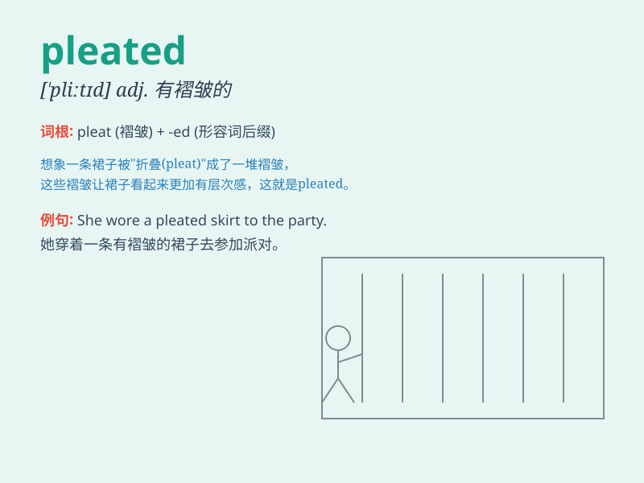

## pleated

**英音:** _[pliːtɪd]_ **美音:** _[pliːtɪd]_

**译义:** *adj.有褶的，打褶的；有褶裥的*

### 短语

+ **pleated skirt:** _百褶裙_

+ **pleated trousers:** _褶裥裤_

+ **pleated fabric:** _打褶织物_

+ **pleated detail:** _褶皱细节_

+ **pleated design:** _褶皱设计_

### 例句

#### 例句1

> **She wore a pleated skirt to the party.**

**中文翻译:** 她穿着一条百褶裙去参加聚会。

**单词释义:** 有褶的；打褶的（形容裙子）

#### 例句2

> **The pleated curtains added elegance to the room.**

**中文翻译:** 打褶的窗帘为房间增添了优雅。

**单词释义:** 打褶的（形容窗帘）

#### 例句3

> **He bought a pair of pleated trousers for the interview.**

**中文翻译:** 他为面试买了一条打褶的裤子。

**单词释义:** 打褶的（形容裤子）

### 背诵小故事

> A little girl was very happy because she got a pleated skirt. The
pleats were so beautiful and made the skirt look unique. She wore it and
danced around.

**一个小女孩非常开心，因为她得到了一条百褶裙。这些褶子非常漂亮，让裙子看起来很独特。她穿上它欢快地跳舞。**

### 图义

