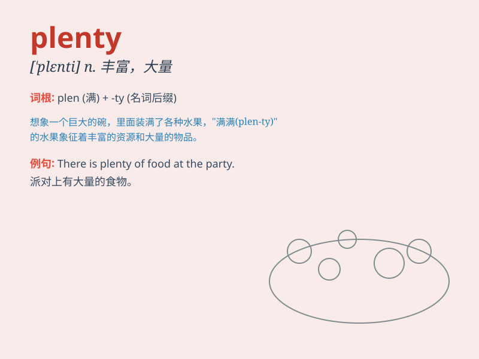

## plenty

**英音:** _[\'plentɪ]_ **美音:** _[\'plɛnti]_

**译义:** *n.丰富,大量*

### 短语

+ **plenty of:** _大量；许多；充足_

+ **in plenty:** _大量；丰富_

+ **a plenty of:** _很多的_

+ **plenty more:** _还有很多；大量的_

+ **give plenty of notice:** _给予充分的通知_

### 例句

#### 例句1

> **There is plenty of food in the fridge.**

**中文翻译:** 冰箱里有大量的食物。

**单词释义:** 大量；充足

#### 例句2

> **We have plenty of time to finish the work.**

**中文翻译:** 我们有充足的时间完成这项工作。

**单词释义:** 充足的

#### 例句3

> **She has plenty of friends at school.**

**中文翻译:** 她在学校有很多朋友。

**单词释义:** 许多；大量

### 背诵小故事

> A poor farmer always worried about having not enough food. One day,
he found a magical field that produced plenty of grains. From then on,
he and his family never went hungry.

**一个贫穷的农民总是担心没有足够的食物。有一天，他发现了一块神奇的田地，产出了大量的谷物。从那以后，他和他的家人再也没有挨过饿。**

### 图义

