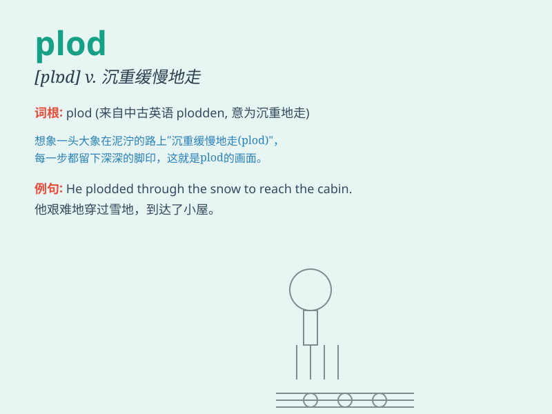

## plod

**英音:** _[plɒd]_ **美音:** _[plɑd]_

**译义:** *n.沉重的脚步vi.沉重地走,辛勤工作vt.沉重缓慢地走*

### 短语

+ **plod along:** _缓慢而吃力地行进_

+ **plod through:** _艰难地完成（某事）_

+ **plod on:** _沉重缓慢地走；坚持下去_

+ **plod away:** _持续努力地工作_

+ **plod up:** _费力地向上走_

### 例句

#### 例句1

> **He plodded along the muddy road, looking tired.**

**中文翻译:** 他艰难地走在泥泞的路上，看上去很疲惫。

**单词释义:** 缓慢而吃力地行走

#### 例句2

> **The horse plodded up the steep hill.**

**中文翻译:** 马儿缓慢地爬上陡峭的山坡。

**单词释义:** 缓慢沉重地行走

#### 例句3

> **She plodded through her daily tasks with little enthusiasm.**

**中文翻译:** 她缓慢地完成日常任务，但没有什么热情。

**单词释义:** 单调乏味地进行

### 背诵小故事

> A little snail was plodding along a long road. It moved slowly but
steadily, never giving up. Just like the snail, when you plod, you keep
going steadily despite difficulties.

**一只小蜗牛在一条长长的路上缓慢地行进。它移动得很慢但很稳定，从不放弃。就像这只蜗牛一样，当你
plod 时，你尽管有困难但仍稳步前进。**

### 图义

