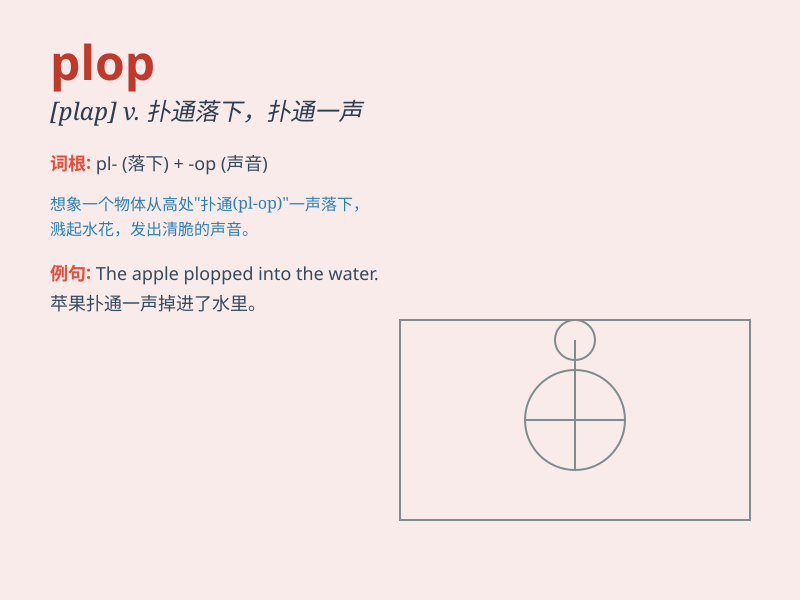

## plop

**英音:** _[plɒp]_ **美音:** _[plɑp]_

**译义:** *n.扑通声,坠落adv.扑通一声地vt.使掉下vi.扑通落下*

### 短语

+ **plop down:** _扑通坐下；重重地坐下_

+ **plop into:** _扑通掉进_

+ **plop out:** _扑通掉出_

+ **plop along:** _啪嗒啪嗒地走_

+ **plop sth on sth:** _把某物重重地放在某物上_

### 例句

#### 例句1

> **The raindrops plop onto the roof.**

**中文翻译:** 雨滴落在屋顶上。

**单词释义:** 发出啪嗒声

#### 例句2

> **He plopped down on the sofa and turned on the TV.**

**中文翻译:** 他一屁股坐在沙发上，打开了电视。

**单词释义:** 扑通坐下

#### 例句3

> **The stone plopped into the water.**

**中文翻译:** 石头扑通一声掉进了水里。

**单词释义:** 扑通一声落入

### 背诵小故事

> One day, I was sitting by the lake and threw a stone into the water.
It made a \'plop\' sound as it hit the surface. The \'plop\' was so
distinct that I\'ll never forget it.

**一天，我坐在湖边，向水里扔了一块石头。石头碰到水面时发出了"扑通"一声。这"扑通"声如此清晰，我永远都忘不了。**

### 图义

