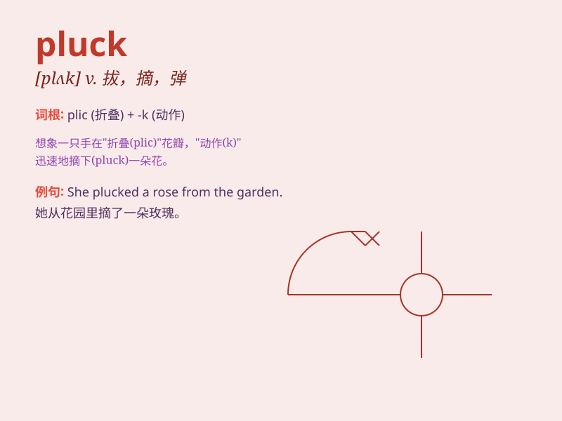

## pluck

**英音:** _[plʌk]_ **美音:** _[plʌk]_

**译义:** *n.勇气v.拔去(鸡、鸭等)毛,采集*

### 短语

+ **pluck up courage:** _鼓起勇气_

+ **pluck at:** _拉扯；拽_

+ **pluck out:** _拔出；摘掉_

+ **pluck up:** _振作；拔起_

+ **pluck away:** _扯去；拉开_

### 例句

#### 例句1

> **She plucked a flower from the garden.**

**中文翻译:** 她从花园里摘了一朵花。

**单词释义:** 摘；拔

#### 例句2

> **He had to pluck up the courage to ask her out.**

**中文翻译:** 他必须鼓起勇气约她出去。

**单词释义:** 鼓起（勇气）

#### 例句3

> **The bird plucks its feathers to keep clean.**

**中文翻译:** 鸟儿拔掉羽毛以保持清洁。

**单词释义:** 啄；扯

### 背诵小故事

> A brave chicken plucked up the courage to face a big dog. It showed
great pluck. The chicken used its beak to pluck at the dog\'s fur, not
giving in. \'Pluck\' means to pull out or show courage.

**一只勇敢的鸡鼓起勇气面对一只大狗。它展现了极大的勇气。这只鸡用它的喙去啄狗的毛，毫不退缩。\'pluck\'有拔出或鼓起勇气的意思。**

### 图义

