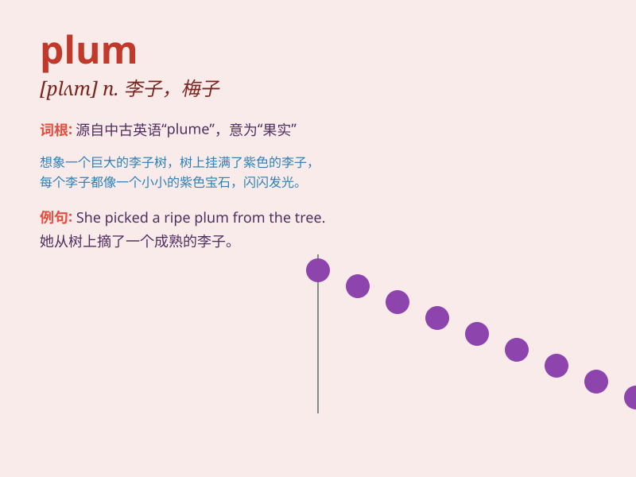

## plum

**英音:** _[plʌm]_ **美音:** _[plʌm]_

**译义:** *n.[植] 李子,洋李*

### 短语

+ **plum tree:** _李树_

+ **plum blossom:** _梅花_

+ **plum pudding:** _葡萄干布丁_

+ **plum job:** _美差；肥缺_

+ **plum color:** _紫红色_

### 例句

#### 例句1

> **I picked a ripe plum from the tree.**

**中文翻译:** 我从树上摘了一颗成熟的李子。

**单词释义:** 李子

#### 例句2

> **The plum jam tastes delicious.**

**中文翻译:** 李子果酱味道鲜美。

**单词释义:** 李子

#### 例句3

> **She wore a plum dress to the party.**

**中文翻译:** 她穿着一件紫红色连衣裙去参加聚会。

**单词释义:** 紫红色

### 背诵小故事

> One day, a little girl was very hungry. She found a plum tree. The
plums on the tree were big and purple. She picked one and ate it. It was
so sweet. She was very happy.

**有一天，一个小女孩非常饿。她发现了一棵李子树。树上的李子又大又紫。她摘了一个吃了。非常甜。她很开心。**

### 图义

