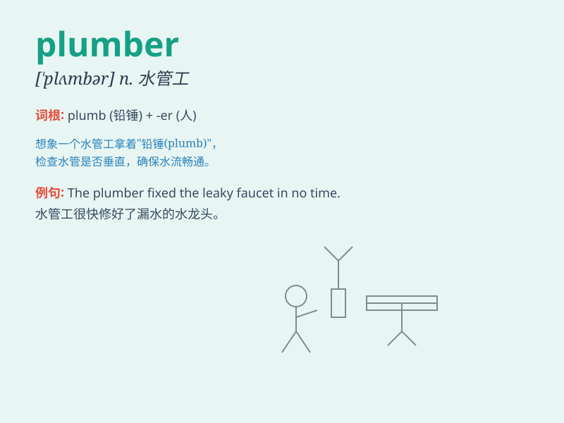

## plumber

**英音:** _[\'plʌmə]_ **美音:** _[\'plʌmɚ]_

**译义:** *n.水管工人*

### 短语

+ **master plumber:** _水管工人师傅_

+ **licensed plumber:** _有执照的水管工_

+ **professional plumber:** _专业水管工_

+ **call a plumber:** _叫水管工_

+ **plumber\'s tools:** _水管工的工具_

### 例句

#### 例句1

> **The plumber came to fix the leaky faucet.**

**中文翻译:** 水管工来修理漏水的水龙头。

**单词释义:** 水管工

#### 例句2

> **We need to call a plumber to unclog the drain.**

**中文翻译:** 我们需要请水管工来疏通排水管。

**单词释义:** 水管工

#### 例句3

> **The plumber installed a new water heater for us.**

**中文翻译:** 水管工为我们安装了一台新热水器。

**单词释义:** 水管工

### 背诵小故事

> One day, the pipes in my house were leaking. A man named Tom came to
fix them. Tom was a plumber. He had all the tools and knew exactly how
to solve the problem. I was so relieved when the pipes were fixed.

**有一天，我家的水管漏水了。一个叫汤姆的人来修理。汤姆是个水管工。他有所有的工具，并且确切地知道如何解决问题。当水管修好时，我松了一口气。**

### 图义

