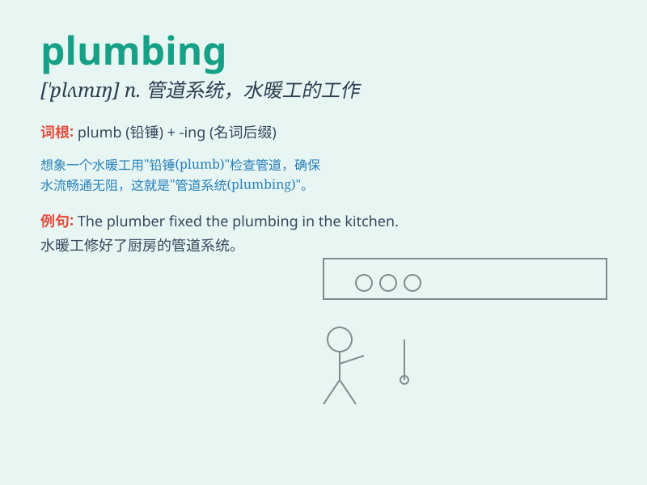

## plumbing

**英音:** _[\'plʌmɪŋ]_ **美音:** _[\'plʌmɪŋ]_

**译义:** *n.铅工业,铅管品制造*

### 短语

+ **plumbing system:** _管道系统_

+ **plumbing fixture:** _卫生洁具_

+ **plumbing work:** _管道工程_

+ **plumbing tools:** _水暖工具_

+ **plumbing emergency:** _管道紧急情况_

### 例句

#### 例句1

> **The plumbing in the old house needs to be completely
overhauled.**

**中文翻译:** 老房子的管道需要彻底检修。

**单词释义:** 管道系统

#### 例句2

> **He learned plumbing as an apprentice.**

**中文翻译:** 他作为学徒学习了管道工程。

**单词释义:** 管道安装

#### 例句3

> **There\'s a leak in the plumbing and water is everywhere.**

**中文翻译:** 水管漏水，到处都是水。

**单词释义:** 管道

### 背诵小故事

> One day, Tom\'s house had a plumbing problem. Water was leaking
everywhere. A professional plumber came and fixed all the pipes. Tom
learned that plumbing is all about the pipes and systems that carry
water in a building.

**有一天，汤姆的房子出现了管道问题。水到处泄漏。一位专业的水管工人来了，修好了所有的管道。汤姆了解到
plumbing 就是关于建筑物中输送水的管道和系统。**

### 图义

