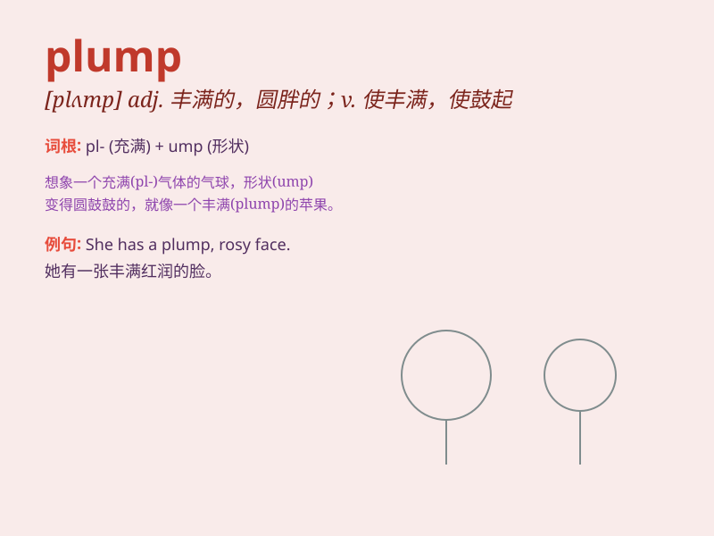

## plump

**英音:** _[plʌmp]_ **美音:** _[plʌmp]_

**译义:**
*adj.圆胖的,丰满的,鼓起的vt.突然放下,使丰满,使鼓起vi.变丰满,鼓起adv.使发胖(或鼓起)的东西,鼓鳃物,沉重(或突然)坠落,沉重地,突然地,坦白地n.扑通声*

### 短语

+ **plump for:** _选中；选定_

+ **plump up:** _使膨胀；使鼓起_

+ **plump down:** _突然坐下；重重地坐下_

+ **plump out:** _使更丰满；使更圆润_

+ **plump face:** _丰满的脸_

### 例句

#### 例句1

> **The plump woman sat comfortably on the sofa.**

**中文翻译:** 胖女人舒服地坐在沙发上。

**单词释义:** 丰满的；胖乎乎的（形容人的身材）

#### 例句2

> **The plump apples looked very tempting.**

**中文翻译:** 饱满的苹果看起来非常诱人。

**单词释义:** 饱满的（形容水果）

#### 例句3

> **She gave the cushion a plump to make it more comfortable.**

**中文翻译:** 她把坐垫弄得鼓鼓的，让坐起来更舒服。

**单词释义:** 使鼓起；使丰满（动词）

### 背诵小故事

> One day, I saw a plump bird sitting on a branch. It had a round body
and looked very cute. The plump bird was eating seeds and its feathers
were fluffy. I thought it must have eaten a lot to become so plump.

**一天，我看到一只丰满的鸟坐在树枝上。它身体圆圆的，看起来非常可爱。这只丰满的鸟正在吃种子，它的羽毛蓬松。我想它一定吃了很多才变得这么丰满。**

### 图义

