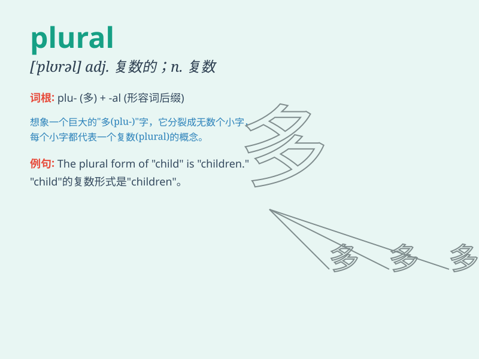

## plural

**英音:** _[\'plʊər(ə)l]_ **美音:** _[\'plʊrəl]_

**译义:** *adj.复数的*

### 短语

+ **plural form:** _复数形式_

+ **plural noun:** _复数名词_

+ **plural society:** _多元社会_

+ **plural voting:** _多次投票_

+ **plural marriage:** _一夫多妻或一妻多夫婚姻_

### 例句

#### 例句1

> **The plural of \'child\' is \'children\'.**

**中文翻译:** "孩子"的复数是"孩子们"。

**单词释义:** 复数

#### 例句2

> **In English, most nouns have a plural form.**

**中文翻译:** 在英语中，大多数名词都有复数形式。

**单词释义:** 复数

#### 例句3

> **The word \'mice\' is the plural of\'mouse\'.**

**中文翻译:** "mice"这个词是"mouse"的复数形式。

**单词释义:** 复数

### 背诵小故事

> A king had many cats. But when he wanted to count them, he was
confused. His advisor said, \'You need to use the plural form, not just
one cat.\' So the king learned that plural means more than one.

**一位国王有很多只猫。但当他想要数猫时，他很困惑。他的顾问说：'您需要用复数形式，而不只是一只猫。'于是国王明白了
plural 表示不止一个。**

### 图义

