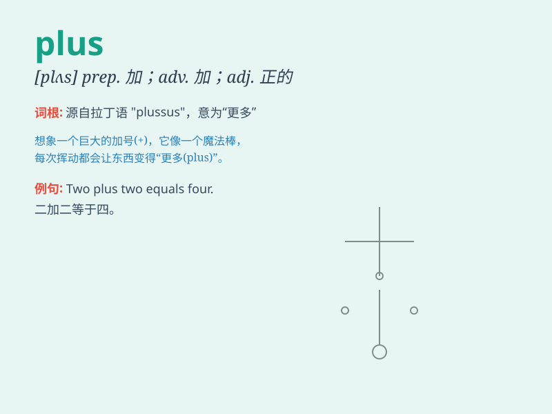

## plus

**英音:** _[plʌs]_ **美音:** _[plʌs]_

**译义:** * prep.加上adj.正的,加的*

### 短语

+ **plus or minus:** _或多或少；左右；大约_

+ **plus sign:** _加号；正号_

+ **plus point:** _优点；长处_

+ **an advantage plus:** _一个额外的优点_

+ **plus size:** _大码；加大码_

### 例句

#### 例句1

> **Two plus three equals five.**

**中文翻译:** 二加三等于五。

**单词释义:** 加；加上

#### 例句2

> **The hotel room charge is \$100 per night, plus tax.**

**中文翻译:** 酒店房费为每晚 100 美元，含税。

**单词释义:** 外加；另有

#### 例句3

> **She has many advantages plus a good sense of humor.**

**中文翻译:** 她有很多优点，而且很有幽默感。

**单词释义:** 而且；此外

### 背诵小故事

> One day, Tom had 5 apples. Then his friend gave him 3 more apples. So
now Tom has 5 plus 3 equals 8 apples. He was very happy.

**一天，汤姆有 5 个苹果。然后他的朋友又给了他 3 个苹果。所以现在汤姆有
5 加 3 等于 8 个苹果。他非常高兴。**

### 图义

