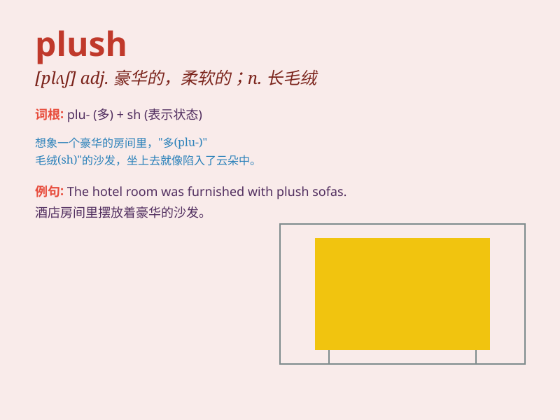

## plush

**英音:** _[plʌʃ]_ **美音:** _[plʌʃ]_

**译义:** *n.长毛绒adj.长毛绒做的,豪华的,舒服的*

### 短语

+ **plush toy:** _毛绒玩具_

+ **plush carpet:** _长毛绒地毯_

+ **plush seat:** _豪华座椅_

+ **plush hotel:** _豪华酒店_

+ **plush fabric:** _长毛绒织物_

### 例句

#### 例句1

> **The hotel room was furnished with plush carpets and comfortable
beds.**

**中文翻译:** 酒店房间配有豪华地毯和舒适的床。

**单词释义:** 豪华的；长毛绒做的

#### 例句2

> **She cuddled the plush toy bear tightly in her arms.**

**中文翻译:** 她把毛绒玩具熊紧紧地抱在怀里。

**单词释义:** 长毛绒做的

#### 例句3

> **The new theater has plush seating and state-of-the-art sound
systems.**

**中文翻译:** 新剧院拥有豪华座椅和最先进的音响系统。

**单词释义:** 豪华的

### 背诵小故事

> A little girl went to a toy store and saw a very soft and cute teddy
bear. She asked her mom, \'What kind of material is this bear made of?\'
Her mom said, \'It\'s made of plush.\' The girl loved the plush bear so
much.

**一个小女孩去玩具店，看到一只非常柔软可爱的泰迪熊。她问妈妈：'这只熊是用什么材料做的？'她妈妈说：'是用长毛绒做的。'小女孩非常喜欢这只长毛绒熊。**

### 图义

