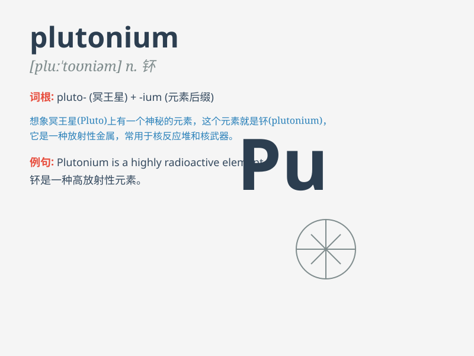

## plutonium

**英音:** _[pluːˈtəʊniəm]_ **美音:** _[pluːˈtoʊniəm]_

**译义:** *n.钚（一种放射性元素，化学符号Pu，原子序数94）*

### 短语

+ **plutonium bomb:** _钚弹_

+ **plutonium core:** _钚芯_

+ **plutonium production:** _钚生产_

+ **plutonium reactor:** _钚反应堆_

+ **plutonium isotope:** _钚同位素_

### 例句

#### 例句1

> **Plutonium is a highly radioactive element.**

**中文翻译:** 钚是一种高放射性元素。

**单词释义:** 钚（一种放射性元素）

#### 例句2

> **The use and handling of plutonium require extreme caution.**

**中文翻译:** 钚的使用和处理需要极度谨慎。

**单词释义:** 钚

#### 例句3

> **Scientists are studying the properties of plutonium for various
applications.**

**中文翻译:** 科学家们正在研究钚的特性以用于各种应用。

**单词释义:** 钚

### 背诵小故事

>
想象一下，有个疯狂的科学家在实验室里寻找一种超级强大的元素，最终他发现了一种叫
plutonium
的物质，它具有巨大的能量，但也非常危险。就像一颗隐藏的炸弹，处理不当就会引发灾难。

**想象一位疯狂科学家在实验室发现具有巨大能量但很危险、处理不当会引发灾难的叫钚（plutonium）的物质。**

### 图义

