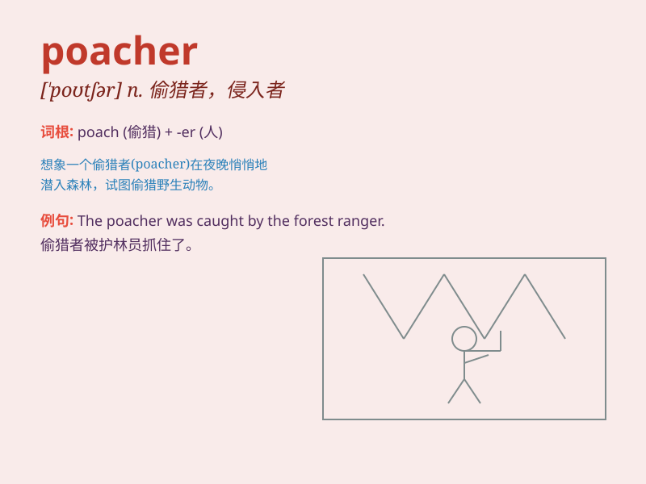

## poacher

**英音:** _[\'pəʊtʃə]_ **美音:** _[\'potʃɚ]_

**译义:** *n.偷猎者,侵入者*

### 短语

+ **egg poacher:** _煮蛋器_

+ **game poacher:** _偷猎者_

+ **fish poacher:** _偷捕鱼者_

+ **poacher turned gamekeeper:** _监守自盗者摇身一变成为监管者_

+ **anti-poacher operation:** _反偷猎行动_

### 例句

#### 例句1

> **The poacher was caught red-handed in the forest.**

**中文翻译:** 偷猎者在森林里被当场抓获。

**单词释义:** 偷猎者

#### 例句2

> **The park rangers are on the lookout for poachers.**

**中文翻译:** 公园管理员正在寻找偷猎者。

**单词释义:** 偷猎者

#### 例句3

> **Poachers have been threatening the survival of many rare
species.**

**中文翻译:** 偷猎者一直威胁着许多稀有物种的生存。

**单词释义:** 偷猎者

### 背诵小故事

> A man was walking in the forest at night. Suddenly, he saw someone
with a flashlight and a net. It was a poacher trying to catch wild
animals illegally. The police came and caught the poacher.

**一个男人在夜晚的森林里行走。突然，他看到有人拿着手电筒和网。那是一个偷猎者在非法捕捉野生动物。警察来了并抓住了这个偷猎者。**

### 图义

