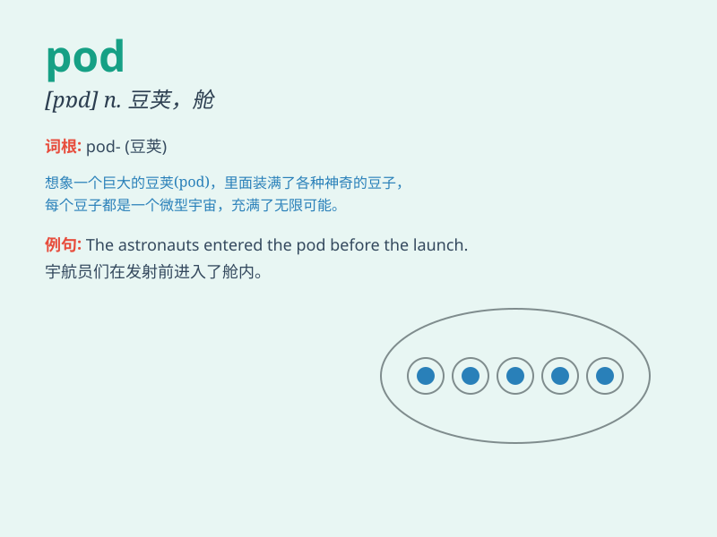

## pod

**英音:** _[pɒd]_ **美音:** _[pɑd]_

**译义:** *n.密集小群,扁豆层,豆荚,蚕茧vi.结荚,生荚*

### 短语

+ **pod cast:** _播客_

+ **seed pod:** _荚；种荚_

+ **pod of whales:** _鲸群_

+ **space pod:** _太空舱_

+ **pod fruit:** _荚果_

### 例句

#### 例句1

> **The peas were in a pod.**

**中文翻译:** 豌豆在豆荚里。

**单词释义:** 豆荚

#### 例句2

> **The whales travel in pods.**

**中文翻译:** 鲸鱼成群结队地游动。

**单词释义:** 群

#### 例句3

> **The space pod landed safely on the planet.**

**中文翻译:** 太空舱安全降落在地球上。

**单词释义:** 舱

### 背诵小故事

> Imagine a group of aliens in a spaceship. They have a special
container called a pod. It\'s like a small room where they store
precious things. One day, they lost the key to the pod and had a big
problem!

**想象一群外星人在宇宙飞船里。他们有一个特殊的容器叫做荚舱。它就像一个小房间，用来存放珍贵的东西。有一天，他们丢了荚舱的钥匙，遇到了大麻烦！**

### 图义

