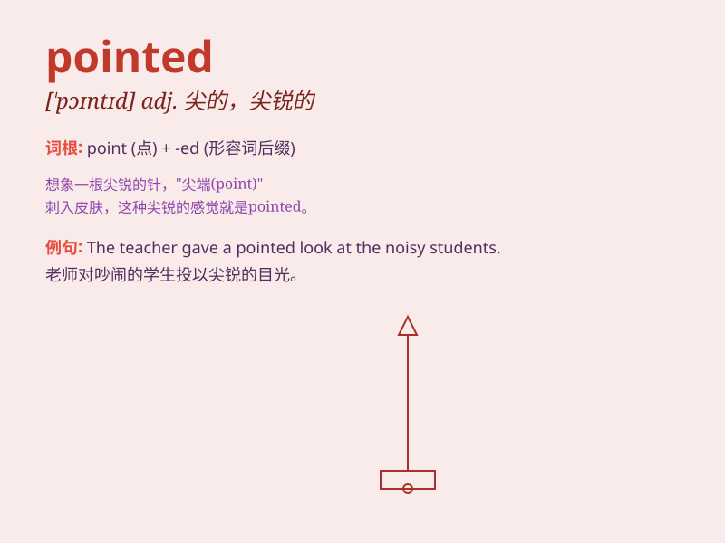

## pointed

**英音:** _[\'pɒɪntɪd]_ **美音:** _[\'pɔɪntɪd]_

**译义:** *adj.尖角的,敏锐的,锐利的,率直的,突出的*

### 短语

+ **pointed remarks:** _尖锐的言论_

+ **pointed nose:** _尖鼻子_

+ **pointed questions:** _尖锐的问题_

+ **pointed tip:** _尖头_

+ **pointed criticism:** _尖锐的批评_

### 例句

#### 例句1

> **The pointed roof of the old house stood out against the sky.**

**中文翻译:** 老房子尖尖的屋顶在天空的映衬下格外显眼。

**单词释义:** 尖的；尖锐的

#### 例句2

> **She made some pointed remarks about his behavior.**

**中文翻译:** 她对他的行为做了一些尖锐的评论。

**单词释义:** 尖锐的；直截了当的

#### 例句3

> **He wore a pointed hat to the costume party.**

**中文翻译:** 他在化装舞会上戴着一顶尖顶帽子。

**单词释义:** 尖顶的

### 背诵小故事

> Once upon a time, there was a little arrow. It had a very sharp and
pointed tip. When it flew, it could easily pierce through things. The
pointed tip made it special and powerful.

**从前，有一支小箭。它有一个非常尖锐和突出的箭头。当它飞的时候，能够轻易地刺穿东西。突出的箭头让它变得特别且强大。**

### 图义

