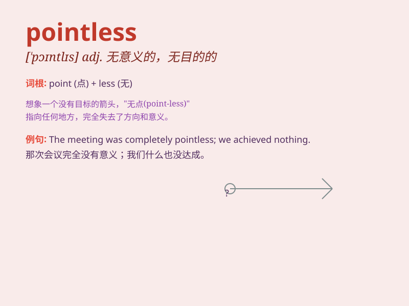

## pointless

**英音:** _[\'pɒɪntlɪs]_ **美音:** _[\'pɔɪntləs]_

**译义:** *adj.无意义的*

### 短语

+ **pointless argument:** _毫无意义的争论_

+ **pointless activity:** _无意义的活动_

+ **pointless talk:** _无意义的谈话_

+ **pointless question:** _无意义的问题_

+ **pointless journey:** _毫无意义的旅行_

### 例句

#### 例句1

> **It\'s pointless to argue with him. He never listens.**

**中文翻译:** 和他争论是没有意义的。他从不听。

**单词释义:** 没有意义的；无用的

#### 例句2

> **This endless waiting seems pointless.**

**中文翻译:** 这种无休止的等待似乎毫无意义。

**单词释义:** 无意义的；无益的

#### 例句3

> **Doing the same thing over and over again is pointless.**

**中文翻译:** 一遍又一遍地做同样的事情是没有意义的。

**单词释义:** 无价值的；徒劳的

### 背诵小故事

> A man was constantly walking in circles, not knowing where he was
going. When asked, he said he had no destination. This aimless behavior
was truly pointless.

**一个男人不停地绕圈走，不知道要去哪里。当被问及时，他说他没有目的地。这种毫无目的的行为真的是毫无意义的。**

### 图义

