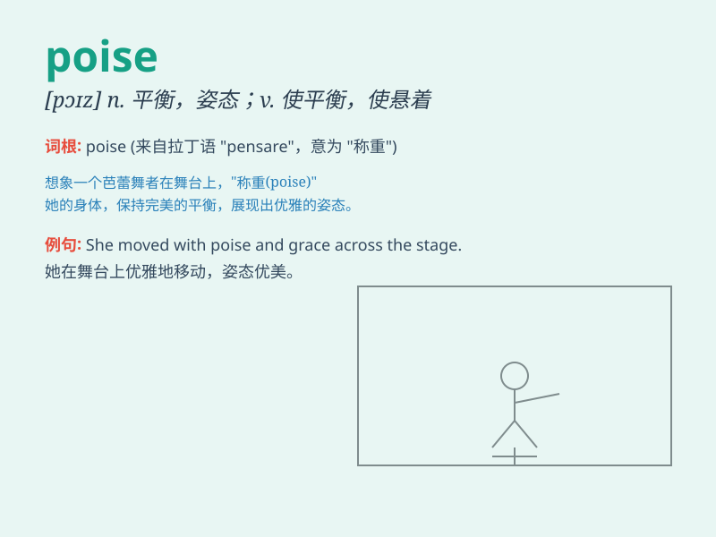

## poise

**英音:** _[pɒɪz]_ **美音:** _[pɔɪz]_

**译义:**
*n.平衡,均衡,姿势,镇静,砝码vt.使平衡,使悬着,保持\...姿势vi.平衡,悬着,准备好,犹豫*

### 短语

+ **poise oneself:** _使自己作好准备_

+ **in poise:** _沉着；泰然自若_

+ **lose one\'s poise:** _失去镇定；失态_

+ **maintain poise:** _保持镇定_

+ **regain poise:** _重新恢复镇定_

### 例句

#### 例句1

> **She carried herself with poise and grace.**

**中文翻译:** 她举止沉着、优雅。

**单词释义:** 镇定；沉着；泰然自若

#### 例句2

> **The gymnast maintained perfect poise throughout her routine.**

**中文翻译:** 这位体操运动员在整个训练过程中都保持着完美的姿势。

**单词释义:** 平衡；平稳

#### 例句3

> **His poise in the face of danger was remarkable.**

**中文翻译:** 他面对危险时的镇定令人惊叹。

**单词释义:** 沉着；冷静

### 背诵小故事

> A little bird was learning to fly. It needed poise to balance in the
air. At first, it struggled, but with practice, it gained the poise and
flew gracefully.

**一只小鸟正在学习飞翔。它需要平衡来在空中保持稳定。起初，它很挣扎，但通过练习，它获得了平衡，优雅地飞了起来。**

### 图义

