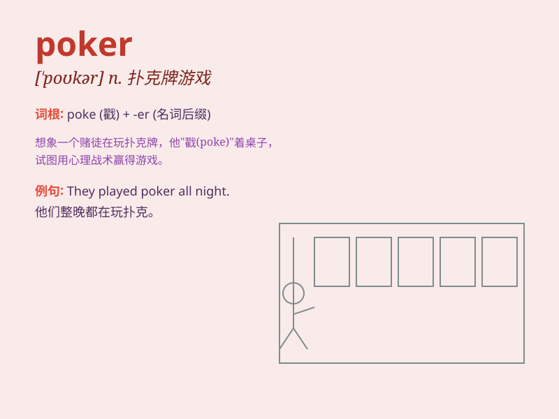

## poker

**英音:** _[\'pəʊkə]_ **美音:** _[\'pokɚ]_

**译义:** *n.拨火棍,(用棍)戳的人,纸牌戏vt.烙制*

### 短语

+ **poker face:** _毫无表情的脸；不动声色的脸_

+ **poker game:** _扑克游戏_

+ **poker player:** _扑克玩家；玩扑克牌的人_

+ **poker tournament:** _扑克锦标赛_

+ **poker chip:** _扑克筹码_

### 例句

#### 例句1

> **He is an expert in playing poker.**

**中文翻译:** 他是玩扑克的专家。

**单词释义:** 扑克

#### 例句2

> **The poker was still hot when she picked it up.**

**中文翻译:** 当她拿起扑克时，它还是热的。

**单词释义:** 拨火棍

#### 例句3

> **She stared at him poker-faced.**

**中文翻译:** 她面无表情地看着他。

**单词释义:** 面无表情的

### 背诵小故事

> One night, a group of friends gathered around a table to play poker.
They had chips and cards, and the tension was high. The winner was the
one who could best predict and strategize. Poker is all about fun and
challenge!

**一天晚上，一群朋友围坐在一张桌子旁玩扑克。他们有筹码和牌，气氛紧张。赢家是那个能最好地预测和制定策略的人。扑克就是关于乐趣和挑战！**

### 图义

