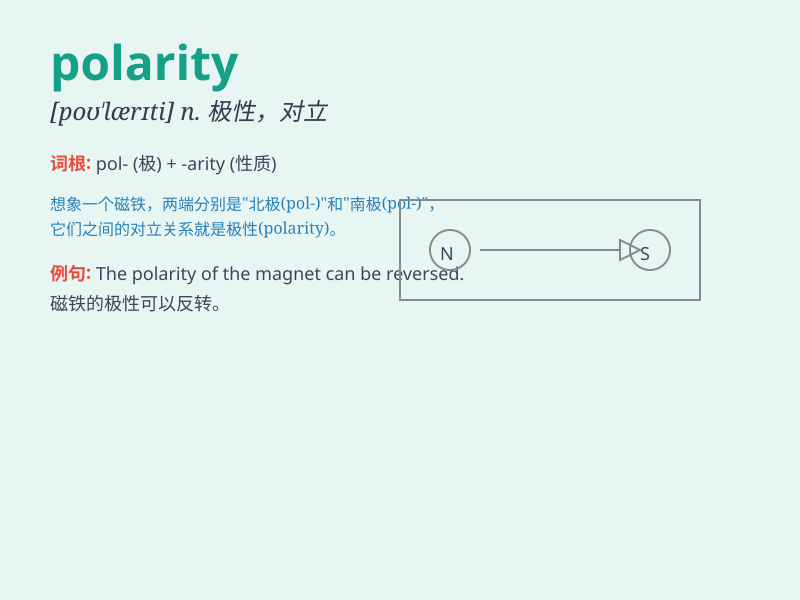

## polarity

**英音:** _[pə(ʊ)\'lærɪtɪ]_ **美音:** _[pə\'lærəti]_

**译义:** *n.极性*

### 短语

+ **magnetic polarity:** _磁极_

+ **polarity reversal:** _极性反转_

+ **electrical polarity:** _电极性_

+ **polarity switch:** _极性转换开关_

+ **polarity indicator:** _极性指示器_

### 例句

#### 例句1

> **The polarity of the magnet was reversed.**

**中文翻译:** 这块磁铁的极性被颠倒了。

**单词释义:** 极性

#### 例句2

> **There is a polarity between optimism and pessimism.**

**中文翻译:** 乐观主义和悲观主义之间存在着对立。

**单词释义:** 对立；两极化

#### 例句3

> **The polarity of the battery needs to be checked before
installation.**

**中文翻译:** 在安装之前需要检查电池的极性。

**单词释义:** 极性

### 背诵小故事

> In a strange world, there was a magical magnet. One end attracted
everything, and the other repelled. This contrast showed the polarity.
It was like a hidden secret that controlled the magnet\'s power.

**在一个奇异的世界里，有一块神奇的磁铁。一端吸引一切，另一端排斥一切。这种对比展现出了极性。它就像一个控制着磁铁力量的隐藏秘密。**

### 图义

