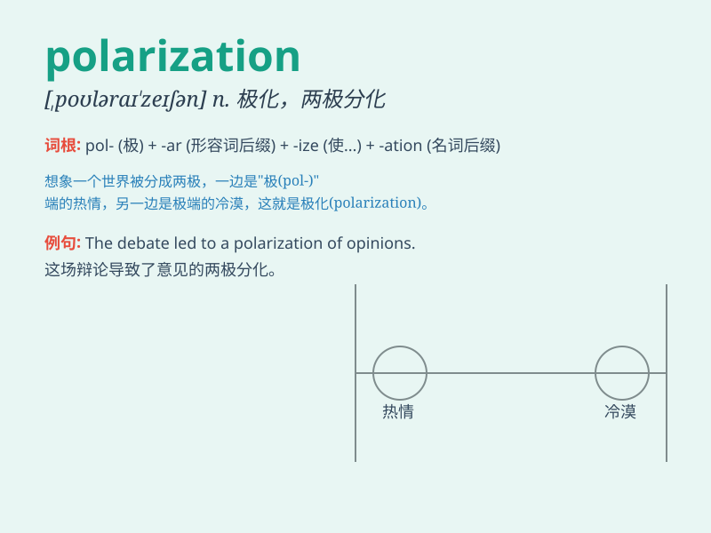

## polarization

**英音:** _[,pəʊləraɪ\'zeɪʃən]_ **美音:**
_[,polərɪ\'zeʃən]_

**译义:** *n.[物]偏振(现象),极化(作用),两极化,分化*

### 短语

+ **optical polarization:** _光偏振_

+ **polarization state:** _偏振态_

+ **linear polarization:** _线偏振_

+ **circular polarization:** _圆偏振_

+ **polarization effect:** _偏振效应_

### 例句

#### 例句1

> **The polarization of society along economic lines is a growing
concern.**

**中文翻译:** 社会沿着经济线的两极分化是一个日益令人担忧的问题。

**单词释义:** 两极分化；极化

#### 例句2

> **The polarization of light can be used in many scientific
experiments.**

**中文翻译:** 光的偏振可用于许多科学实验。

**单词释义:** 偏振；极化

#### 例句3

> **Political polarization has made it difficult to reach consensus
on important issues.**

**中文翻译:** 政治上的两极分化使得在重要问题上难以达成共识。

**单词释义:** 两极分化

### 背诵小故事

> In a faraway land, people had different opinions on a big issue. This
led to a split and a strong division, which was called polarization. It
was like a big magnet pulling everyone to opposite sides.

**在一个遥远的地方，人们对一个重大问题有不同的看法。这导致了分裂和强烈的分歧，这就被称为两极分化。就像一块大磁铁把每个人都拉向相反的方向。**

### 图义

