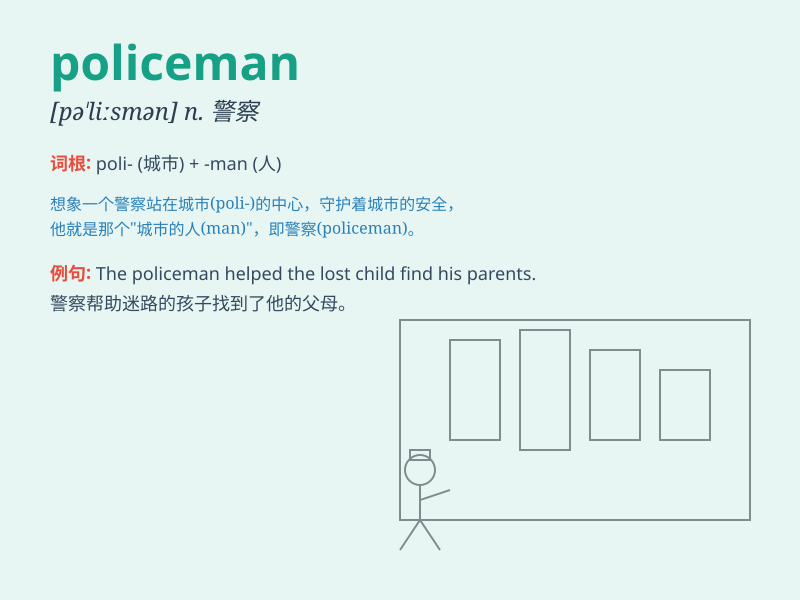

## policeman

**英音:** _[pə\'liːsmən]_ **美音:** _[pə\'lismən]_

**译义:** *n.警察*

### 短语

+ **traffic policeman:** _交通警察_

+ **policeman on duty:** _值班警察_

+ **experienced policeman:** _经验丰富的警察_

+ **local policeman:** _当地警察_

+ **young policeman:** _年轻警察_

### 例句

#### 例句1

> **The policeman is helping the old lady cross the street.**

**中文翻译:** 这位警察正在帮助那位老太太过马路。

**单词释义:** 警察（指正在帮助老太太过马路的这个人）

#### 例句2

> **A policeman came to the scene of the accident immediately.**

**中文翻译:** 一名警察立即赶到了事故现场。

**单词释义:** 警察（泛指来到事故现场的这名警务人员）

#### 例句3

> **The brave policeman caught the thief in the end.**

**中文翻译:** 这位勇敢的警察最终抓住了小偷。

**单词释义:** 警察（强调其勇敢并成功抓住小偷）

### 背诵小故事

> One day, a thief was running away. A brave policeman saw it and
chased after him quickly. Finally, the policeman caught the thief and
protected people\'s property. Remember, \'policeman\' is the hero who
keeps us safe.

**一天，一个小偷在逃跑。一位勇敢的警察看到了，迅速追了上去。最后，警察抓住了小偷，保护了人们的财产。记住，\'policeman\'就是保护我们安全的英雄。**

### 图义

