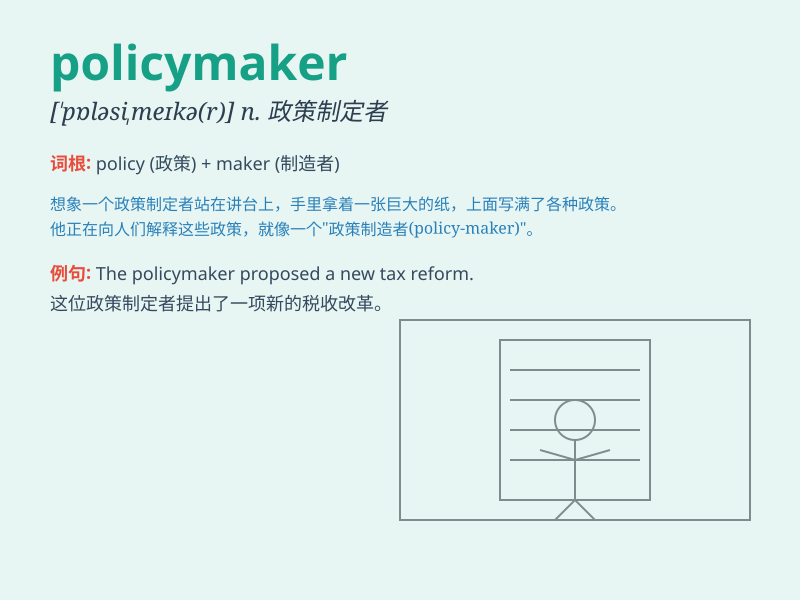

## policymaker

**英音:** _[\'pɒləsɪmeɪkə(r)]_ **美音:**
_[\'pɒləsɪˌmeɪkə]_

**译义:** *n.政策制定者,决策人*

### 短语

+ **government policymaker:** _政府决策者_

+ **senior policymaker:** _高级决策者_

+ **economic policymaker:** _经济决策者_

+ **influential policymaker:** _有影响力的决策者_

+ **domestic policymaker:** _国内决策者_

### 例句

#### 例句1

> **The policymaker has proposed a new economic policy to boost
growth.**

**中文翻译:** 这位政策制定者提出了一项新的经济政策以促进增长。

**单词释义:** 政策制定者

#### 例句2

> **Policymakers are considering measures to improve education
quality.**

**中文翻译:** 政策制定者们正在考虑采取措施来提高教育质量。

**单词释义:** 政策制定者

#### 例句3

> **The decisions of policymakers often have a significant impact on
people\'s lives.**

**中文翻译:** 政策制定者的决定常常对人们的生活有重大影响。

**单词释义:** 政策制定者

### 背诵小故事

> A policymaker was lost in a big city. He needed to find the right way
to make policies for the people. But it was so confusing! Finally, with
wisdom and courage, he made good decisions.

**一位政策制定者在一个大城市里迷失了。他需要为人民找到制定政策的正确方法。但这太令人困惑了！最终，凭借智慧和勇气，他做出了好的决策。**

### 图义

