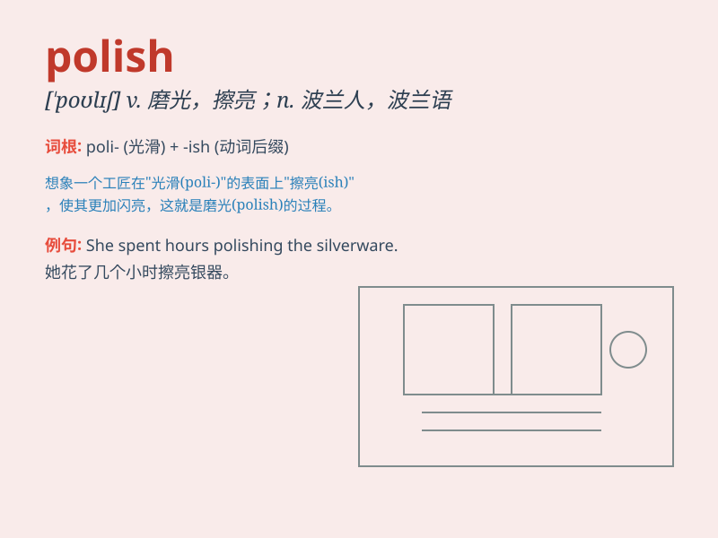

## Polish

**英音:** _[ˈpɒlɪʃ]_ **美音:** _[ˈpɑːlɪʃ]_

**译义:** *1. v. 把\...磨光;擦亮

2\. n. 磨光剂;擦光剂

3\. adj. 波兰的;波兰人的

4\. n. 波兰语

注意: polish
作为动词时，表示打磨、擦亮；作为名词时，可以表示磨光剂、擦光剂；作为形容词时，表示波兰的、波兰人的；还代表波兰语。*

### 短语

+ **Polish off:** _迅速做完；很快吃光（或喝完）_

+ **Polish up:** _改善；润色_

+ **Shoe polish:** _鞋油_

+ **Polish furniture:** _擦亮家具_

+ **Polish one\'s skills:** _提高某人的技能_

### 例句

#### 例句1

> **She spent hours polishing the silverware.**

**中文翻译:** 她花了几个小时擦拭银器。

**单词释义:** 擦拭；磨光

#### 例句2

> **This essay needs some polish to make it perfect.**

**中文翻译:** 这篇文章需要一些润色才能完美。

**单词释义:** 润色；改善

#### 例句3

> **He has a natural polish in his manners.**

**中文翻译:** 他举止自然优雅。

**单词释义:** 优雅；修养

### 背诵小故事

> A little girl was polishing her shoes carefully to make them shiny.
She worked hard and finally the shoes looked perfect. Polish means to
make something smooth and shiny by rubbing.

**一个小女孩正在仔细地擦亮她的鞋子，想让它们闪闪发亮。她努力擦拭，最后鞋子看起来完美极了。Polish
这个单词的意思是通过擦拭使某物光滑且有光泽。**

### 图义

