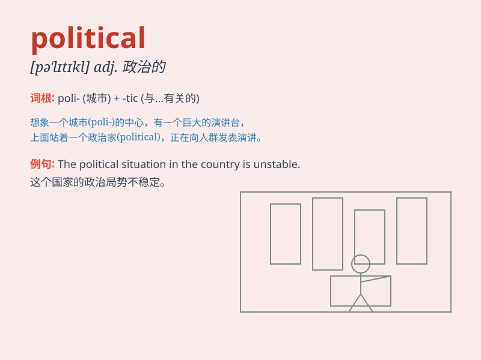

## political

**英音:** _[pə\'lɪtɪk(ə)l]_ **美音:** _[pə\'lɪtɪkl]_

**译义:** *adj.政治的,行政上的*

### 短语

+ **political party:** _政党_

+ **political system:** _政治制度_

+ **political view:** _政治观点_

+ **political leader:** _政治领袖_

+ **political crisis:** _政治危机_

### 例句

#### 例句1

> **He is very interested in political affairs.**

**中文翻译:** 他对政治事务非常感兴趣。

**单词释义:** 政治的

#### 例句2

> **The political situation in the country is complex.**

**中文翻译:** 这个国家的政治局势很复杂。

**单词释义:** 政治的

#### 例句3

> **She has a deep understanding of political issues.**

**中文翻译:** 她对政治问题有深刻的理解。

**单词释义:** 政治的

### 背诵小故事

> A king wanted to make political changes. He gathered wise men to
discuss. They talked about laws and policies to make the country better.
Finally, they found the right way. Remember, \'political\' is about
these matters of the state and governance.

**一位国王想要进行政治变革。他召集了智者来讨论。他们谈论法律和政策以使国家变得更好。最后，他们找到了正确的方法。记住，\'political\'就是关于国家和治理的这些事务。**

### 图义

