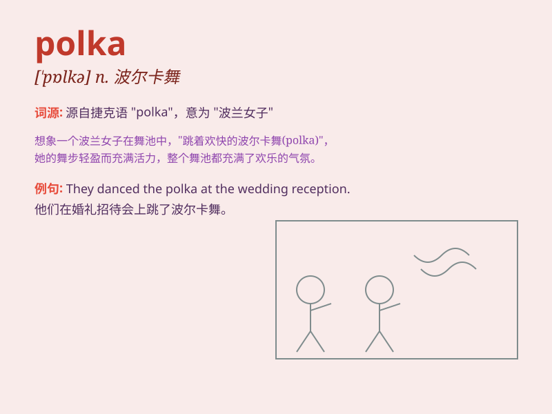

## polka

**英音:** _[\'pɒlkə; \'pəʊlkə]_ **美音:** _[\'polkə]_

**译义:** *n.波尔卡舞,女用紧身短上衣*

### 短语

+ **polka dot:** _圆点花纹_

+ **polka music:** _波尔卡音乐_

+ **do the polka:** _跳波尔卡舞_

+ **polka dress:** _波尔卡连衣裙_

+ **polka steps:** _波尔卡舞步_

### 例句

#### 例句1

> **She wore a dress with a polka dot pattern for the party.**

**中文翻译:** 她为聚会穿了一件带波尔卡圆点图案的连衣裙。

**单词释义:** 波尔卡圆点

#### 例句2

> **The couple danced the polka gracefully on the stage.**

**中文翻译:** 这对夫妇在舞台上优雅地跳着波尔卡舞。

**单词释义:** 波尔卡舞

#### 例句3

> **He played a polka on his accordion and everyone joined in.**

**中文翻译:** 他用手风琴演奏了一首波尔卡，大家都加入了进来。

**单词释义:** 波尔卡（乐曲）

### 背诵小故事

> A girl named Polly loved dancing. One day, she discovered a unique
dance called the polka. She practiced hard and became a star in the
polka dance. Every time she danced the polka, people were charmed.

**一个叫波莉的女孩喜欢跳舞。有一天，她发现了一种独特的舞蹈叫波尔卡舞。她努力练习，成为了波尔卡舞的明星。每次她跳波尔卡舞，人们都被迷住了。**

### 图义

