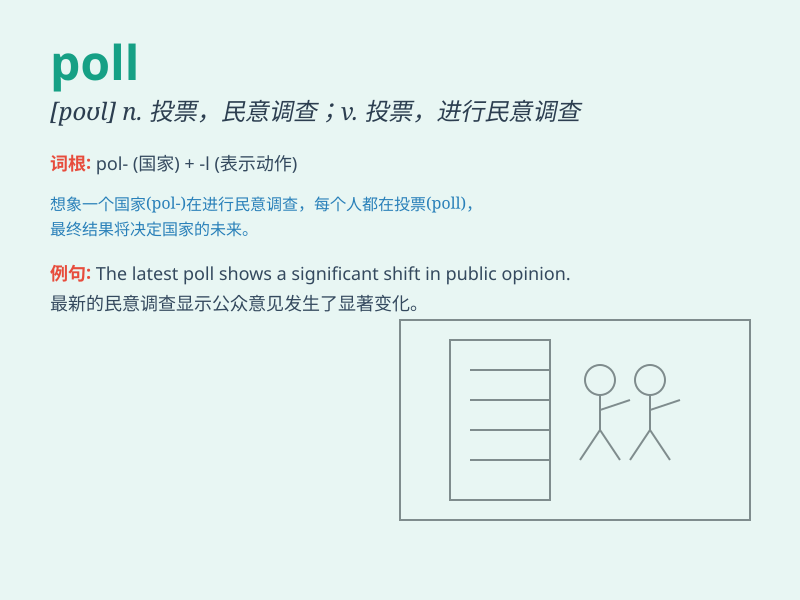

## poll

**英音:** _[pəʊl]_ **美音:** _[pol]_

**译义:** *n.选举之投票,民意测验v.投票,获得选票,选举中获得*

### 短语

+ **opinion poll:** _民意测验_

+ **poll tax:** _人头税_

+ **exit poll:** _投票后民意测验_

+ **poll booth:** _投票站_

+ **polling station:** _投票站；投票所_

### 例句

#### 例句1

> **The latest poll shows that the opposition party is gaining
popularity.**

**中文翻译:** 最新的民意调查显示反对党越来越受欢迎。

**单词释义:** 民意调查

#### 例句2

> **They went to the polling station to cast their votes.**

**中文翻译:** 他们去投票站投票。

**单词释义:** 投票站

#### 例句3

> **The tree was polled to make it grow straight.**

**中文翻译:** 这棵树被修剪了顶部以让它长得笔直。

**单词释义:** 截去（树的）顶枝

### 背诵小故事

> A king wanted to know people\'s opinions about a new law. So, he sent
his men to conduct a poll in the city. People came and gave their
answers. The king finally got the information he needed.

**一位国王想知道人们对于一项新法律的看法。于是，他派手下在城市里进行民意调查。人们前来给出他们的答案。最终国王得到了他需要的信息。**

### 图义

