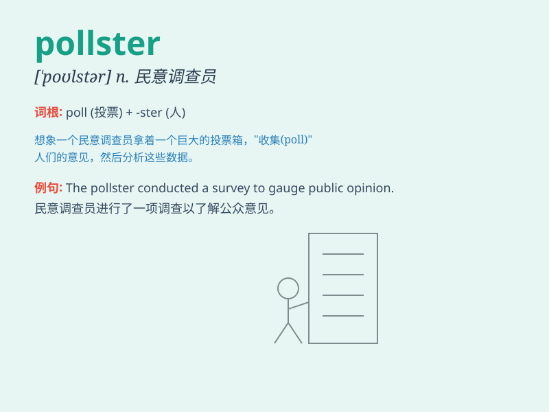

## pollster

**英音:** _[\'pəʊlstə]_ **美音:** _[\'polstɚ]_

**译义:** *n.民意测验专家,整理民意测验结果的人*

### 短语

+ **public pollster:** _公众民意调查员_

+ **professional pollster:** _专业民意测验专家_

+ **political pollster:** _政治民意调查员_

+ **accurate pollster:** _准确的民意调查员_

+ **reliable pollster:** _可靠的民意调查员_

### 例句

#### 例句1

> **The pollster conducted a survey to gauge public opinion on the
new policy.**

**中文翻译:**
这位民意调查员进行了一项调查，以衡量公众对新政策的看法。

**单词释义:** 民意调查员

#### 例句2

> **Pollsters are often hired by political campaigns to predict
election outcomes.**

**中文翻译:** 民意调查员经常被政治竞选活动雇佣来预测选举结果。

**单词释义:** 民意调查员

#### 例句3

> **The pollster\'s findings were presented at the conference.**

**中文翻译:** 民意调查员的调查结果在会议上被展示。

**单词释义:** 民意调查员

### 背诵小故事

> 想象一下，在一个投票站里，有个专门负责统计票数的人，他就是
pollster。他认真记录着每一张选票，以确定大家的选择。这个 pollster
就像一个数据侦探，为了解公众的想法而努力工作。

**想象在投票站中负责统计票数的人，像数据侦探一样工作，以此记住
pollster（民意调查者）这个单词。**

### 图义

