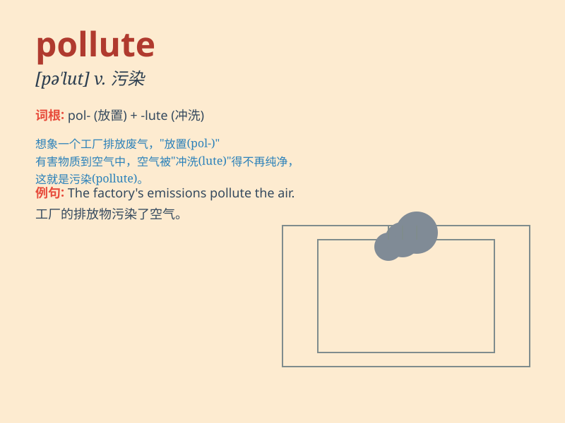

## pollute

**英音:** _[pə\'luːt]_ **美音:** _[pə\'lut]_

**译义:** *vt.弄脏,污染*

### 短语

+ **pollute the environment:** _污染环境_

+ **pollute the air:** _污染空气_

+ **pollute the water:** _污染水_

+ **be polluted:** _被污染_

+ **pollute seriously:** _严重污染_

### 例句

#### 例句1

> **The factory is constantly polluting the river with chemical
waste.**

**中文翻译:** 这家工厂不断地用化学废料污染河流。

**单词释义:** 污染

#### 例句2

> **Excessive use of pesticides can pollute the soil.**

**中文翻译:** 过度使用农药会污染土壤。

**单词释义:** 污染

#### 例句3

> **We must take measures to prevent air from being polluted.**

**中文翻译:** 我们必须采取措施防止空气被污染。

**单词释义:** 污染

### 背诵小故事

> A factory was built near a beautiful river. The factory kept
releasing harmful substances, which polluted the clear water. The once
lively fish and the green grass along the river all suffered. Remember,
pollute means to make something dirty and harmful.

**一家工厂建在了一条美丽的河流附近。这家工厂不断排放有害物质，污染了清澈的河水。曾经活跃的鱼儿和河边的绿草都遭了殃。记住，pollute
意思是使某物变脏和有害。**

### 图义

