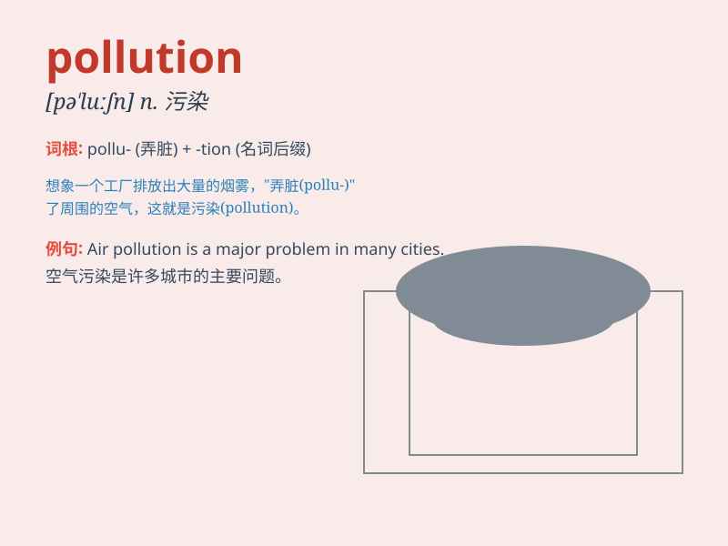

## pollution

**英音:** _[pə\'luːʃ(ə)n]_ **美音:** _[pə\'luʃən]_

**译义:** *n.污染,玷污*

### 短语

+ **air pollution:** _空气污染_

+ **water pollution:** _水污染_

+ **noise pollution:** _噪音污染_

+ **environmental pollution:** _环境污染_

+ **pollution control:** _污染控制_

### 例句

#### 例句1

> **The pollution of the river has reached a dangerous level.**

**中文翻译:** 这条河的污染已经达到了危险的程度。

**单词释义:** 污染（名词，指河流受到的有害影响）

#### 例句2

> **Air pollution is a serious problem in many cities.**

**中文翻译:** 在许多城市，空气污染是一个严重的问题。

**单词释义:** 污染（名词，指空气受到的有害影响）

#### 例句3

> **We must take measures to reduce pollution.**

**中文翻译:** 我们必须采取措施来减少污染。

**单词释义:** 污染（名词，泛指各种有害的环境影响）

### 背诵小故事

> A beautiful fish was swimming happily in the river. But one day,
factories nearby started dumping waste, causing pollution. The water
became dirty and the fish couldn\'t breathe. Poor fish!

**一条漂亮的鱼在河里快乐地游着。但有一天，附近的工厂开始倾倒废物，造成了污染。水变得很脏，鱼无法呼吸。可怜的鱼！**

### 图义

