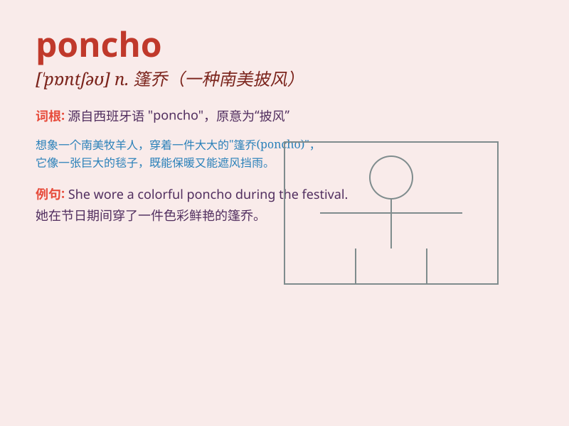

## poncho

**英音:** _[\'pɒn(t)ʃəʊ]_ **美音:** _[\'pɑntʃo]_

**译义:** *n.雨布*

### 短语

+ **rain poncho:** _雨披_

+ **woolen poncho:** _羊毛披风_

+ **cotton poncho:** _棉质披风_

+ **fashionable poncho:** _时尚披风_

+ **travel poncho:** _旅行披风_

### 例句

#### 例句1

> **She wore a colorful poncho to protect herself from the rain.**

**中文翻译:** 她穿了一件色彩鲜艳的雨披来防雨。

**单词释义:** 雨披

#### 例句2

> **The traveler carried a warm poncho for the cold nights in the
mountains.**

**中文翻译:** 这位旅行者带了一件暖和的披风以应对山里寒冷的夜晚。

**单词释义:** 披风

#### 例句3

> **He wrapped himself in a poncho and sat by the campfire.**

**中文翻译:** 他裹着一件斗篷，坐在篝火旁。

**单词释义:** 斗篷

### 背诵小故事

> One rainy day, Tom was caught in the storm without an umbrella.
Luckily, a kind stranger gave him a poncho to keep him dry. The poncho
was like a magic cloak that protected him. From then on, Tom always
remembered the word \'poncho\'.

**在一个下雨天，汤姆被困在暴风雨中没带伞。幸运的是，一位善良的陌生人给了他一件雨披来保持干燥。这件雨披就像一件神奇的斗篷保护着他。从那以后，汤姆总是记住了\'poncho\'这个单词。**

### 图义

