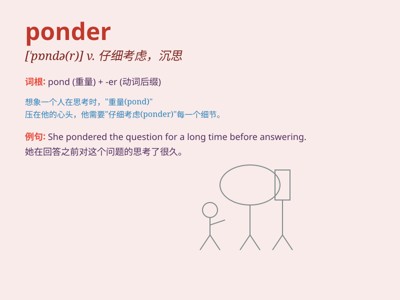

## ponder

**英音:** _[\'pɒndə]_ **美音:** _[\'pɑndɚ]_

**译义:** *v.沉思,考虑*

### 短语

+ **ponder over:** _仔细考虑；深思_

+ **ponder on:** _思考；考虑_

+ **ponder deeply:** _深入思考_

+ **ponder carefully:** _仔细思考_

+ **ponder the meaning:** _思考含义_

### 例句

#### 例句1

> **She sat quietly, pondering her next move.**

**中文翻译:** 她静静地坐着，思考着下一步行动。

**单词释义:** 仔细考虑；沉思

#### 例句2

> **He spent hours pondering the problem but couldn\'t find a
solution.**

**中文翻译:** 他花了几个小时思考这个问题，但找不到解决办法。

**单词释义:** 深思；琢磨

#### 例句3

> **Let\'s ponder over the best way to approach this task.**

**中文翻译:** 让我们仔细考虑完成这项任务的最佳方法。

**单词释义:** 思索；沉思

### 背诵小故事

> A little boy was standing by a river, looking at the flowing water
and pondering how it never stops. He thought deeply about the mystery of
life, just like we need to ponder difficult questions.

**一个小男孩站在河边，看着流淌的河水，思考着它为何永不停息。他深深地思考着生命的奥秘，就像我们需要深思难题一样。**

### 图义

