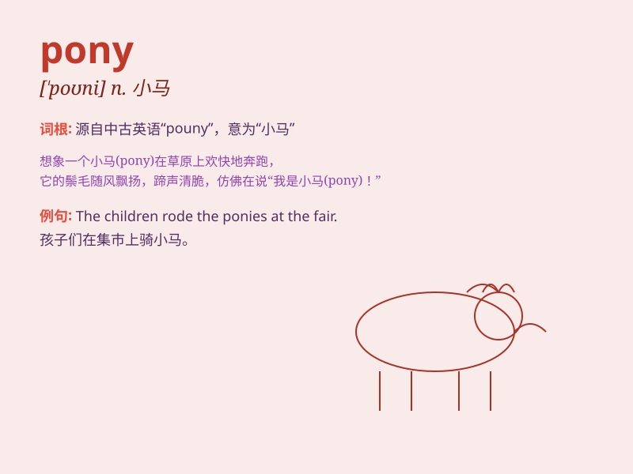

## pony

**英音:** _[\'pəʊnɪ]_ **美音:** _[\'poni]_

**译义:** *n.小型马v.付清adj.小型的,(新闻)每日摘要的*

### 短语

+ **pony tail:** _马尾辫_

+ **pony ride:** _骑马游戏_

+ **wild pony:** _野马_

+ **pony cart:** _小马车_

+ **pony express:** _驿马快信_

### 例句

#### 例句1

> **The little girl loves to ride her pony in the park.**

**中文翻译:** 这个小女孩喜欢在公园里骑她的小马。

**单词释义:** 小马

#### 例句2

> **He bought a pony for his daughter\'s birthday.**

**中文翻译:** 他为女儿的生日买了一匹小马。

**单词释义:** 小马

#### 例句3

> **The pony was very gentle and friendly.**

**中文翻译:** 这匹小马非常温顺友好。

**单词释义:** 小马

### 背诵小故事

> A little girl dreams of having a pony. One day, she walks in the
forest and magically finds a pony. The pony has a beautiful mane and is
very friendly. The girl is so happy and names it Star.

**一个小女孩梦想拥有一匹小马。有一天，她在森林里散步，神奇地发现了一匹小马。这匹小马有着漂亮的鬃毛，而且非常友好。小女孩非常高兴，并给它取名为星星。**

### 图义

