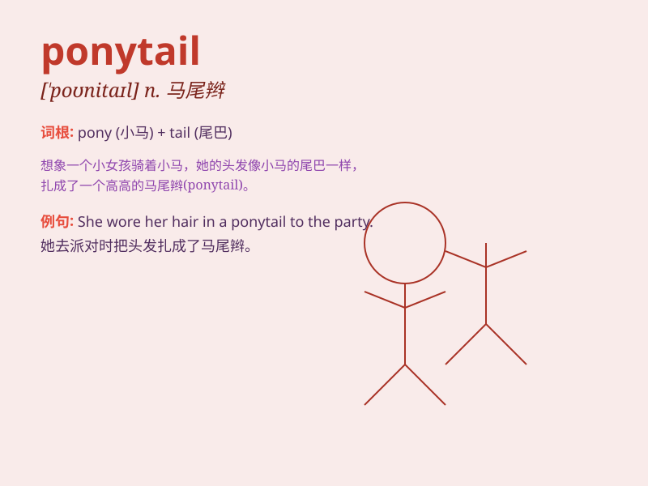

## ponytail

**英音:** _[\'pəʊnɪteɪl]_ **美音:** _[\'ponɪ\'tel]_

**译义:** *n.马尾辫(一种发型)*

### 短语

+ **wear a ponytail:** _扎着一个马尾辫_

+ **loose ponytail:** _松散的马尾辫_

+ **high ponytail:** _高马尾辫_

+ **side ponytail:** _侧马尾辫_

+ **ponytail holder:** _马尾辫发夹_

### 例句

#### 例句1

> **She tied her hair in a ponytail for the gym.**

**中文翻译:** 她为了去健身房把头发扎成了一个马尾辫。

**单词释义:** 马尾辫

#### 例句2

> **The little girl looked cute with her ponytail swinging as she
ran.**

**中文翻译:** 那个小女孩跑起来时，她的马尾辫晃来晃去，看起来很可爱。

**单词释义:** 马尾辫

#### 例句3

> **She always wears her hair in a ponytail when she\'s at work.**

**中文翻译:** 她工作时总是把头发扎成一个马尾辫。

**单词释义:** 马尾辫

### 背诵小故事

> Once upon a time, there was a little girl. She had long hair and
loved to tie it up in a ponytail. Every day, she happily ran around with
her ponytail swinging behind her. It made her look cute and energetic.

**从前，有一个小女孩。她有一头长发并且喜欢把头发扎成一个马尾辫。每天，她开心地到处跑，她的马尾辫在身后晃来晃去。这让她看起来可爱又有活力。**

### 图义

