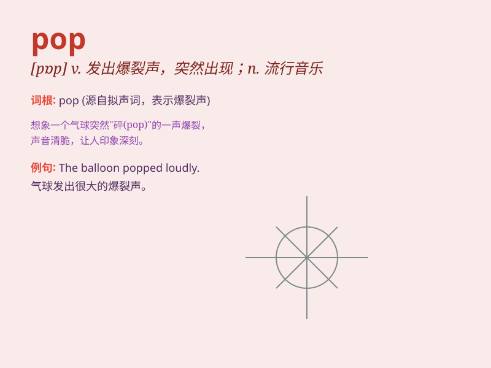

## pop

**英音:** _[pɒp]_ **美音:** _[pɑp]_

**译义:**
*n.取出,砰然声,枪击,流行乐曲;adj.流行的,热门的,通俗的;vt.开枪打,抛出,取出,突然伸出,突然行动;adv.突然,砰地;vi.发出爆裂声,爆开,射击,突然出现,瞪大;n.\<口>汽水;Post
Office Protocol,电子邮件协议*

### 短语

+ **pop music:** _流行音乐_

+ **pop star:** _流行歌星_

+ **pop up:** _突然出现；冒出_

+ **pop the question:** _求婚_

+ **pop in:** _偶然来访；突然出现_

### 例句

#### 例句1

> **The balloon popped suddenly.**

**中文翻译:** 气球突然爆开了。

**单词释义:** （使）爆裂，爆开

#### 例句2

> **She popped a candy into her mouth.**

**中文翻译:** 她把一颗糖果放进嘴里。

**单词释义:** 放，（迅速或突然）放置

#### 例句3

> **He pops in to see me whenever he\'s in town.**

**中文翻译:** 他每次进城都会顺便来看我。

**单词释义:** 突然出现，（迅速）来

### 背诵小故事

> A boy was walking in the street. Suddenly, a balloon popped. The
sound was like a surprise. Then he saw a pop star on a poster and was so
excited.

**一个男孩正在街上走着。突然，一个气球爆开了。那声音就像一个惊喜。然后他看到一张海报上的流行歌星，非常兴奋。**

### 图义

