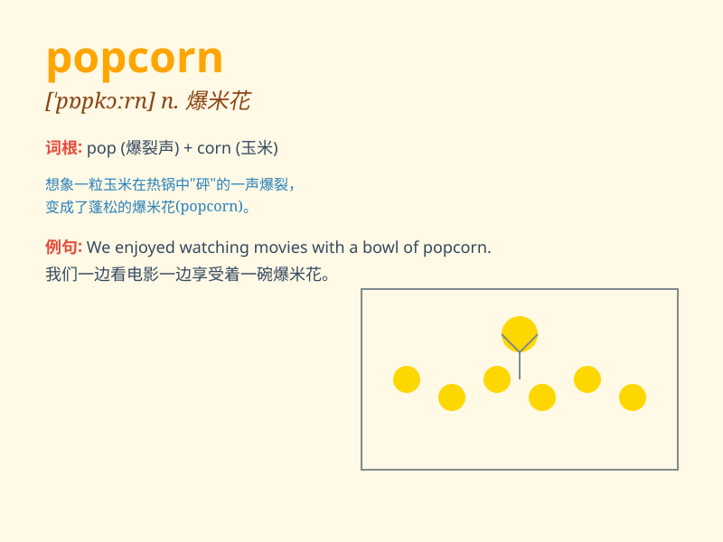

## popcorn

**英音:** _[\'pɒpkɔːn]_ **美音:** _[\'pɑpkɔrn]_

**译义:** *n.爆米花*

### 短语

+ **popcorn machine:** _爆米花机_

+ **buttered popcorn:** _黄油爆米花_

+ **sweet popcorn:** _甜爆米花_

+ **popcorn kernel:** _爆米花玉米粒_

+ **popcorn snack:** _爆米花零食_

### 例句

#### 例句1

> **I love eating popcorn while watching movies.**

**中文翻译:** 我喜欢在看电影的时候吃爆米花。

**单词释义:** 爆米花

#### 例句2

> **The smell of freshly popped popcorn filled the room.**

**中文翻译:** 新鲜爆好的爆米花的香味充满了房间。

**单词释义:** 爆米花

#### 例句3

> **She bought a large bag of popcorn at the fair.**

**中文翻译:** 她在集市上买了一大袋爆米花。

**单词释义:** 爆米花

### 背诵小故事

> One day, I went to the cinema. Before the movie started, I bought a
big bag of popcorn. The popcorn was so delicious. It popped in the
machine and filled the bag with its sweet smell. I enjoyed it a lot
during the film.

**有一天，我去电影院。电影开始前，我买了一大袋爆米花。爆米花非常美味。它在机器里爆开，让袋子充满了香甜的气味。我在看电影时非常享受它。**

### 图义

