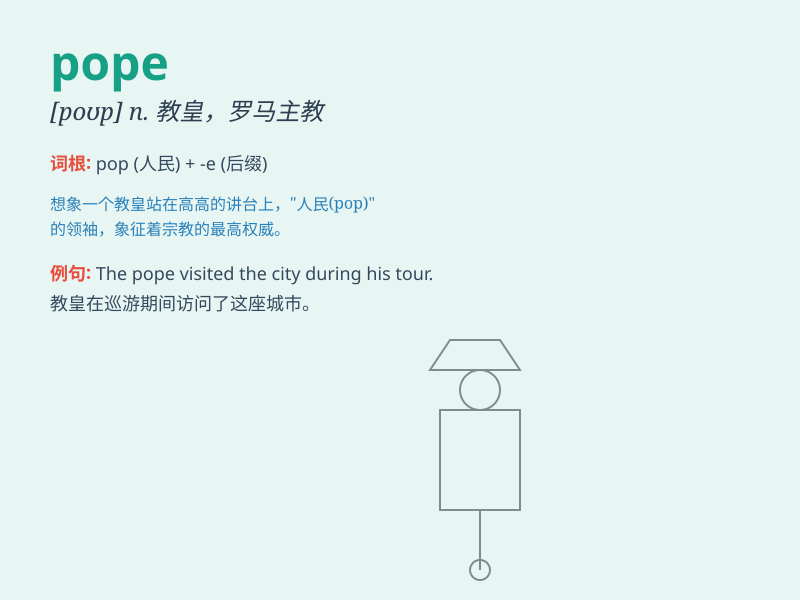

## pope

**英音:** _[pəʊp]_ **美音:** _[poʊp]_

**译义:** *n.教皇,罗马天主教会的最高领袖*

### 短语

+ **The Pope:** _教皇_

+ **Pope John:** _约翰教皇_

+ **Pope Francis:** _方济各教皇_

+ **anti-Pope:** _对立教皇；伪教皇_

+ **papal conclave to elect a new pope:** _选举新教皇的秘密会议_

### 例句

#### 例句1

> **The pope visited the country to offer spiritual guidance.**

**中文翻译:** 教皇访问了这个国家以提供精神指引。

**单词释义:** 教皇

#### 例句2

> **The decision of the pope is highly respected by Catholics.**

**中文翻译:** 教皇的决定受到天主教徒的高度尊重。

**单词释义:** 教皇

#### 例句3

> **People gathered to see the pope during his procession.**

**中文翻译:** 人们聚集起来在教皇游行期间观看他。

**单词释义:** 教皇

### 背诵小故事

> A young boy dreamt of meeting the pope. One day, he traveled far and
finally saw the pope in a grand church. The pope\'s smile and kindness
left a deep impression on him. From then on, he never forgot the word
\'pope\'.

**一个小男孩梦想见到教皇。有一天，他长途跋涉，终于在一座宏伟的教堂里见到了教皇。教皇的微笑和亲切给他留下了深刻的印象。从那以后，他再也忘不了'pope'这个词。**

### 图义

