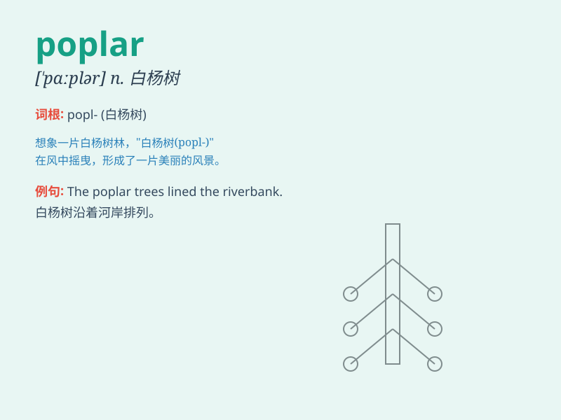

## poplar

**英音:** _[ˈpɒplə(r)]_ **美音:** _[ˈpɑːplər]_

**译义:** *n.白杨,白杨木*

### 短语

+ **black poplar:** _黑杨_

+ **white poplar:** _银白杨_

+ **poplar tree:** _杨树_

+ **poplar grove:** _杨树林_

+ **poplar wood:** _杨木_

### 例句

#### 例句1

> **The poplar trees along the river sway gently in the breeze.**

**中文翻译:** 河边的杨树在微风中轻轻摇曳。

**单词释义:** 杨树

#### 例句2

> **The wood of poplar is often used in making furniture.**

**中文翻译:** 杨树的木材常用于制作家具。

**单词释义:** 杨树

#### 例句3

> **A flock of birds rest on the branches of the poplar.**

**中文翻译:** 一群鸟在杨树的树枝上休息。

**单词释义:** 杨树

### 背诵小故事

> A little bird was lost and found a poplar tree. It rested on a branch
and sang happily. The poplar\'s leaves rustled in the wind, as if
greeting the bird. Soon, the bird regained its strength and flew away.
Remember, poplar is the name of this tree!

**一只小鸟迷路了，发现了一棵杨树。它在一根树枝上休息并欢快地歌唱。杨树的叶子在风中沙沙作响，仿佛在和小鸟打招呼。很快，小鸟恢复了体力飞走了。记住，poplar
就是这种树的名字！**

### 图义

