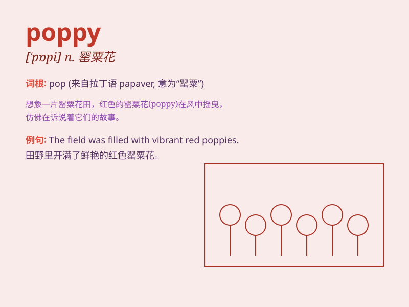

## poppy

**英音:** _[\'pɒpɪ]_ **美音:** _[\'pɑpi]_

**译义:** *n.[植]罂粟,深红色*

### 短语

+ **opium poppy:** _罂粟_

+ **California poppy:** _花菱草_

+ **poppy seed:** _罂粟籽_

+ **poppy flower:** _罂粟花_

+ **poppy red:** _罂粟红_

### 例句

#### 例句1

> **The poppy is a beautiful flower but it also has a symbolic
meaning related to war remembrance.**

**中文翻译:**
罂粟花是一种美丽的花，但它也具有与战争纪念有关的象征意义。

**单词释义:** 罂粟花

#### 例句2

> **She wore a dress with poppy prints.**

**中文翻译:** 她穿了一件有罂粟花图案的连衣裙。

**单词释义:** 罂粟花

#### 例句3

> **The field was filled with colorful poppies.**

**中文翻译:** 田野里满是色彩鲜艳的罂粟花。

**单词释义:** 罂粟花

### 背诵小故事

> One day, a little girl was walking in the field and saw a beautiful
poppy. She was so amazed by its bright color. She wanted to pick it but
remembered that we should protect nature. So she just took a photo and
left happily.

**有一天，一个小女孩在田野里散步，看到了一朵漂亮的罂粟花。她对其鲜艳的颜色感到十分惊奇。她想摘下来，但想起应该保护大自然。于是她只拍了张照片就开心地离开了。**

### 图义

