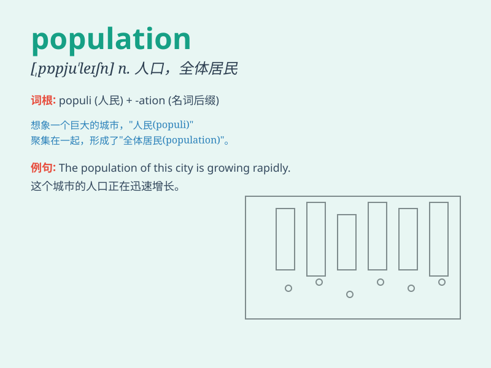

## population

**英音:** _[pɒpjʊ\'leɪʃ(ə)n]_ **美音:** _[ˌpɑpjuˈleɪʃn]_

**译义:** *n.人口*

### 短语

+ **population density:** _人口密度_

+ **population growth:** _人口增长_

+ **population explosion:** _人口爆炸_

+ **aging population:** _老龄化人口_

+ **rural population:** _农村人口_

### 例句

#### 例句1

> **The population of this city is increasing rapidly.**

**中文翻译:** 这座城市的人口正在迅速增长。

**单词释义:** 人口

#### 例句2

> **The government is concerned about the population aging
problem.**

**中文翻译:** 政府关注人口老龄化问题。

**单词释义:** 人口

#### 例句3

> **The population density in this area is very high.**

**中文翻译:** 这个地区的人口密度非常高。

**单词释义:** 人口

### 背诵小故事

> In a small town, the mayor was worried about the population. It was
growing too fast and there weren\'t enough resources. So, he made plans
to manage it better and ensure a balanced life for everyone.

**在一个小镇上，镇长很担心人口问题。人口增长太快，资源不够了。所以，他制定计划更好地管理，以确保每个人都能生活平衡。**

### 图义

