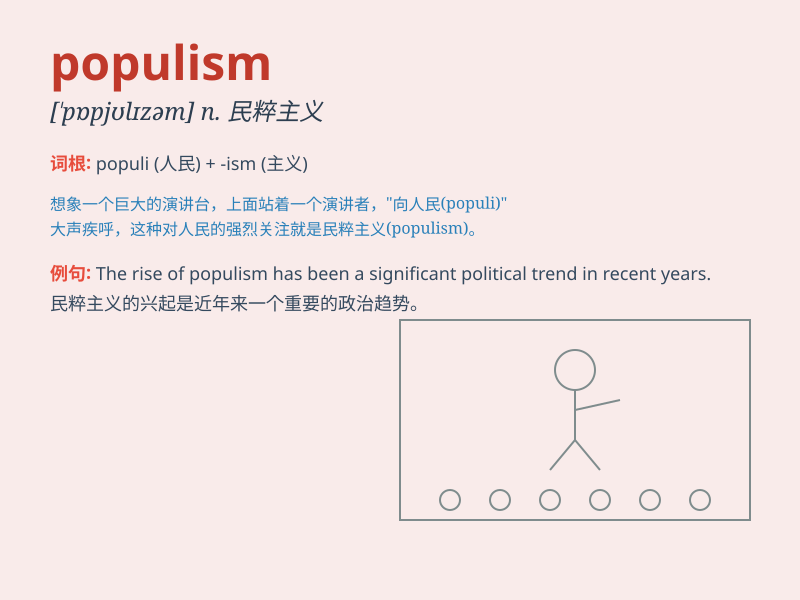

## populism

**英音:** _[ˈpɒpjəlɪzəm]_ **美音:** _[ˈpɑːpjəlɪzəm]_

**译义:** *n.人民党主义,旧俄民粹主义*

### 短语

+ **agrarian populism:** _农业民粹主义_

+ **economic populism:** _经济民粹主义_

+ **populism movement:** _民粹主义运动_

+ **populism ideology:** _民粹主义意识形态_

+ **political populism:** _政治民粹主义_

### 例句

#### 例句1

> **The rise of populism has brought significant changes to the
political landscape.**

**中文翻译:** 民粹主义的兴起给政治格局带来了重大变化。

**单词释义:** 民粹主义

#### 例句2

> **Populism often appeals to the emotions and fears of the
masses.**

**中文翻译:** 民粹主义常常迎合大众的情绪和恐惧。

**单词释义:** 民粹主义

#### 例句3

> **Some politicians use populism as a tool to gain popularity.**

**中文翻译:** 一些政客把民粹主义当作获取人气的工具。

**单词释义:** 民粹主义

### 背诵小故事

> A group of villagers were very angry because the rich ignored their
needs. They united under the idea of populism, fighting for the
interests and rights of ordinary people like themselves.

**一群村民非常愤怒，因为富人忽视了他们的需求。他们在平民主义的理念下团结起来，为像他们自己这样的普通人的利益和权利而斗争。**

### 图义

