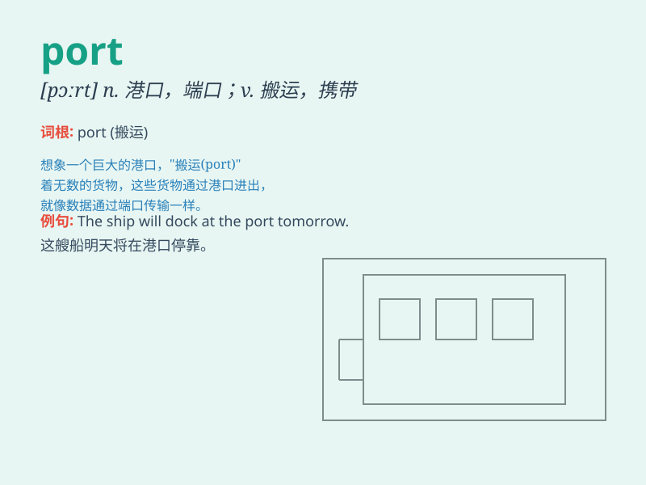

## port

**英音:** _[pɔːt]_ **美音:** _[pɔrt]_

**译义:**
*n.港口,舱门,左舷,避风港,枪眼vt.左转舵,持(枪)vi.转舵左n.端口*

### 短语

+ **port of call:** _停靠港；中途停靠的港口_

+ **port wine:** _波尔图葡萄酒；波特酒_

+ **serial port:** _串行端口；串口_

+ **port authority:** _港务局_

+ **air port:** _机场_

### 例句

#### 例句1

> **The ship arrived at the port.**

**中文翻译:** 这艘船抵达了港口。

**单词释义:** 港口

#### 例句2

> **He carried the heavy box through the port.**

**中文翻译:** 他搬着那个重箱子穿过了通道。

**单词释义:** 通道；门口

#### 例句3

> **The computer has several ports for connecting devices.**

**中文翻译:** 这台电脑有几个用于连接设备的端口。

**单词释义:** 端口；接口

### 背诵小故事

> A brave sailor reached a new land through the port. He carried
precious goods and a map. The port was his gateway to adventure and
fortune. Remember, \'port\' is a place where ships come and go.

**一位勇敢的水手通过港口到达了新大陆。他带着珍贵的货物和地图。港口是他通向冒险和财富的通道。记住，\'port\'是船只来来往往的地方。**

### 图义

