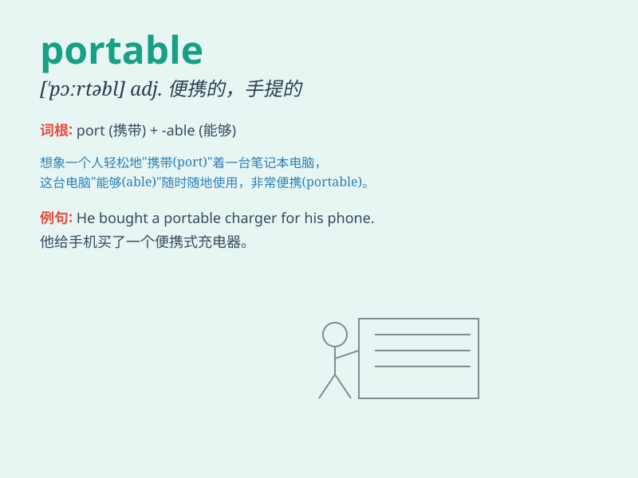

## portable

**英音:** _[\'pɔːtəb(ə)l]_ **美音:** _[\'pɔrtəbl]_

**译义:** *adj.轻便的,手提(式)的,便携式的*

### 短语

+ **portable computer:** _便携式计算机_

+ **portable device:** _便携式设备_

+ **portable generator:** _便携式发电机_

+ **portable speaker:** _便携式扬声器_

+ **portable water:** _便携式水_

### 例句

#### 例句1

> **The portable computer is very convenient for business trips.**

**中文翻译:** 这台便携式电脑对于出差非常方便。

**单词释义:** 便携式的；轻便的

#### 例句2

> **She always carries a portable charger with her.**

**中文翻译:** 她总是随身携带一个便携式充电器。

**单词释义:** 便携式的；轻便的

#### 例句3

> **This portable speaker has excellent sound quality.**

**中文翻译:** 这个便携式扬声器音质极佳。

**单词释义:** 便携式的；轻便的

### 背诵小故事

> A traveler was lost in a forest. Luckily, he found a portable lamp
that could be carried easily. With the light of the portable lamp, he
found his way out. The lamp was so useful because it was portable.

**一位旅行者在森林中迷路了。幸运的是，他找到了一个便于携带的手提灯。凭借这个便携式的灯发出的光，他找到了出路。这个灯很有用，因为它是便携式的。**

### 图义

