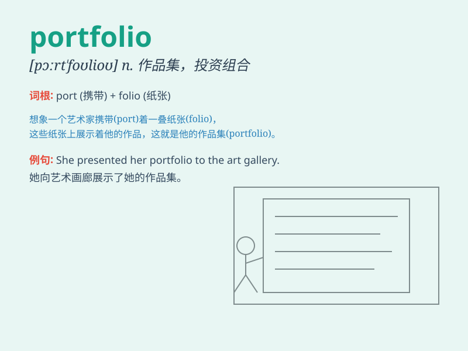

## portfolio

**英音:** _[pɔːt\'fəʊlɪəʊ]_ **美音:** _[pɔrt\'folɪo]_

**译义:** *n.部长职务*

### 短语

+ **investment portfolio:** _投资组合_

+ **portfolio management:** _投资组合管理_

+ **portfolio assessment:** _投资组合评估_

+ **portfolio diversification:** _投资组合多元化_

+ **artist\'s portfolio:** _艺术家的作品选集_

### 例句

#### 例句1

> **He showed me his portfolio of paintings.**

**中文翻译:** 他给我展示了他的绘画作品集。

**单词释义:** （某人或机构的）投资组合；作品集

#### 例句2

> **The portfolio of the minister includes various policy areas.**

**中文翻译:** 这位部长的职责范围包括多个政策领域。

**单词释义:** （某人的）职责，职务

#### 例句3

> **She is building a diverse portfolio of stocks and bonds.**

**中文翻译:** 她正在构建一个多元化的股票和债券投资组合。

**单词释义:** 投资组合

### 背诵小故事

>
想象一下，一位艺术家精心整理他的作品，把绘画、雕塑等放进一个大文件夹。这个文件夹就像他的
portfolio ，里面装满了他的成果和心血。它代表着他的作品集、投资组合。

**想象一位艺术家整理作品的场景来记住 portfolio
这个词，表示作品集、投资组合**

### 图义

