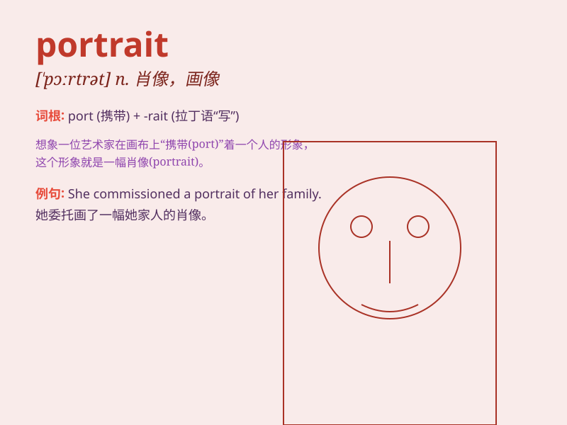

## portrait

**英音:** _[ˈpɔːtrət]_ **美音:** _[\'pɔrtrɪt]_

**译义:** *n.肖像,人像*

### 短语

+ **portrait painting:** _肖像画_

+ **portrait gallery:** _肖像画廊_

+ **portrait photography:** _肖像摄影_

+ **full-length portrait:** _全身像_

+ **half-length portrait:** _半身像_

### 例句

#### 例句1

> **The portrait of the queen hung on the wall of the palace.**

**中文翻译:** 女王的肖像挂在宫殿的墙上。

**单词释义:** 肖像；画像

#### 例句2

> **She sat for a portrait by a famous artist.**

**中文翻译:** 她坐着由一位著名的艺术家为她画肖像。

**单词释义:** 肖像画

#### 例句3

> **The book contains many beautiful portraits of children.**

**中文翻译:** 这本书里有许多漂亮的儿童肖像。

**单词释义:** 肖像；画像

### 背诵小故事

> A painter was asked to draw a portrait of a famous actor. He spent
days observing every detail, from the actor\'s smile to the twinkle in
his eyes. Finally, the beautiful portrait was completed and everyone
loved it.

**一位画家被要求为一位著名演员画一幅肖像。他花了好几天时间观察每一个细节，从演员的微笑到他眼睛里的光芒。最后，这幅美丽的肖像画完成了，每个人都很喜欢。**

### 图义

