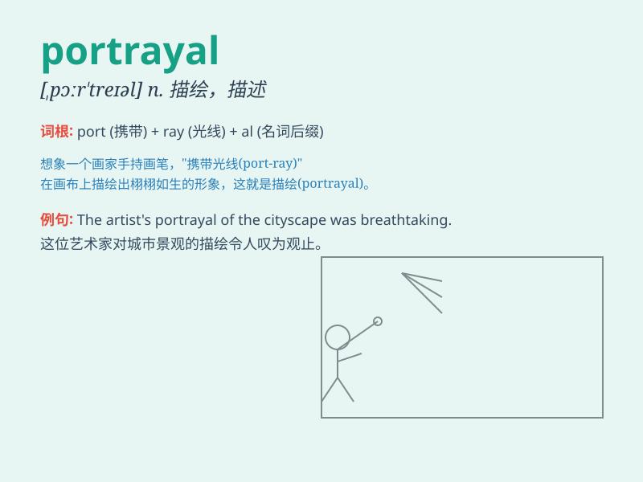

## portrayal

**英音:** _[pɔː\'treɪəl]_ **美音:** _[pɔr\'treəl]_

**译义:** *n.描画,描写*

### 短语

+ **accurate portrayal:** _准确的描绘_

+ **vivid portrayal:** _生动的描绘_

+ **graphic portrayal:** _形象的描绘_

+ **realistic portrayal:** _逼真的描绘_

+ **emotional portrayal:** _情感上的描绘_

### 例句

#### 例句1

> **The actor\'s portrayal of the king was highly praised by the
critics.**

**中文翻译:** 这位演员对国王的刻画受到了评论家的高度赞扬。

**单词释义:** 描绘；扮演；表现

#### 例句2

> **The book offers a vivid portrayal of life in the countryside.**

**中文翻译:** 这本书生动地描绘了乡村生活。

**单词释义:** 描绘；描写

#### 例句3

> **Her portrayal of the character was so realistic that it moved the
audience to tears.**

**中文翻译:** 她对这个角色的刻画如此逼真，以至于感动得观众落泪。

**单词释义:** 刻画；描绘

### 背诵小故事

> A painter was asked to make a portrayal of a beautiful garden. He
spent days observing every detail, from the colorful flowers to the
winding paths. Finally, his painting showed the garden perfectly.
Remember, portrayal is like this painter\'s creation, a detailed
description or representation.

**一位画家被要求描绘一个美丽的花园。他花了好几天观察每个细节，从五颜六色的花朵到蜿蜒的小路。最后，他的画完美地展现了花园。记住，portrayal
就像这位画家的创作，是一种详细的描述或表现。**

### 图义

