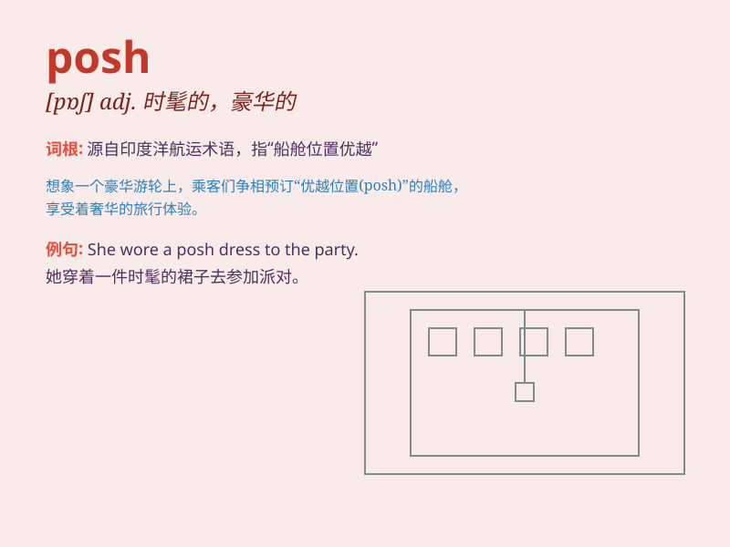

## posh

**英音:** _[pɒʃ]_ **美音:** _[pɑʃ]_

**译义:** *adj.[口]时髦地,豪华的,漂亮的,优雅的,极好的*

### 短语

+ **posh hotel:** _豪华酒店_

+ **posh car:** _高档汽车_

+ **posh neighborhood:** _高档社区_

+ **posh dress:** _时髦的连衣裙_

+ **posh accent:** _优雅的口音_

### 例句

#### 例句1

> **She always stays in posh hotels when she travels.**

**中文翻译:** 她旅行时总是住在豪华酒店。

**单词释义:** 豪华的；时髦的

#### 例句2

> **The posh restaurant has an extensive wine list.**

**中文翻译:** 这家高档餐厅有丰富的酒单。

**单词释义:** 高档的；一流的

#### 例句3

> **He drives a posh car to show off his wealth.**

**中文翻译:** 他开着一辆豪华汽车来炫耀他的财富。

**单词释义:** 豪华的；阔气的

### 背诵小故事

>
有一天，小明参加了一个豪华派对，看到了很多穿着时尚、举止优雅的人。他感叹道：\'These
people are so posh!\'（这些人太时髦优雅了！）后来他就记住了 posh
这个表示时髦优雅、豪华的单词。

**有一天，小明参加豪华派对，看到时髦优雅的人，感叹这些人很
posh，记住了这个表示时髦优雅、豪华的单词**

### 图义

